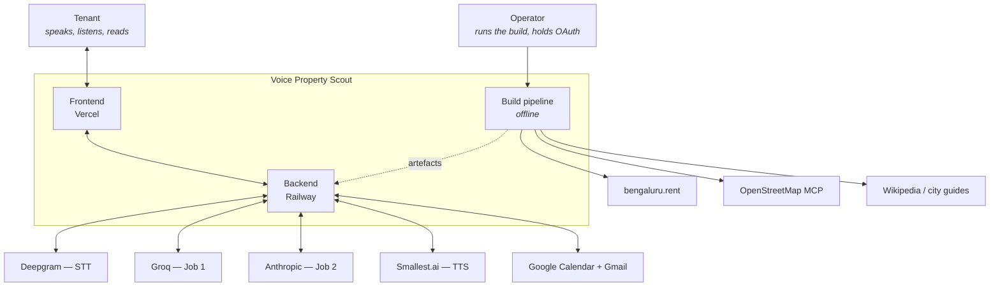
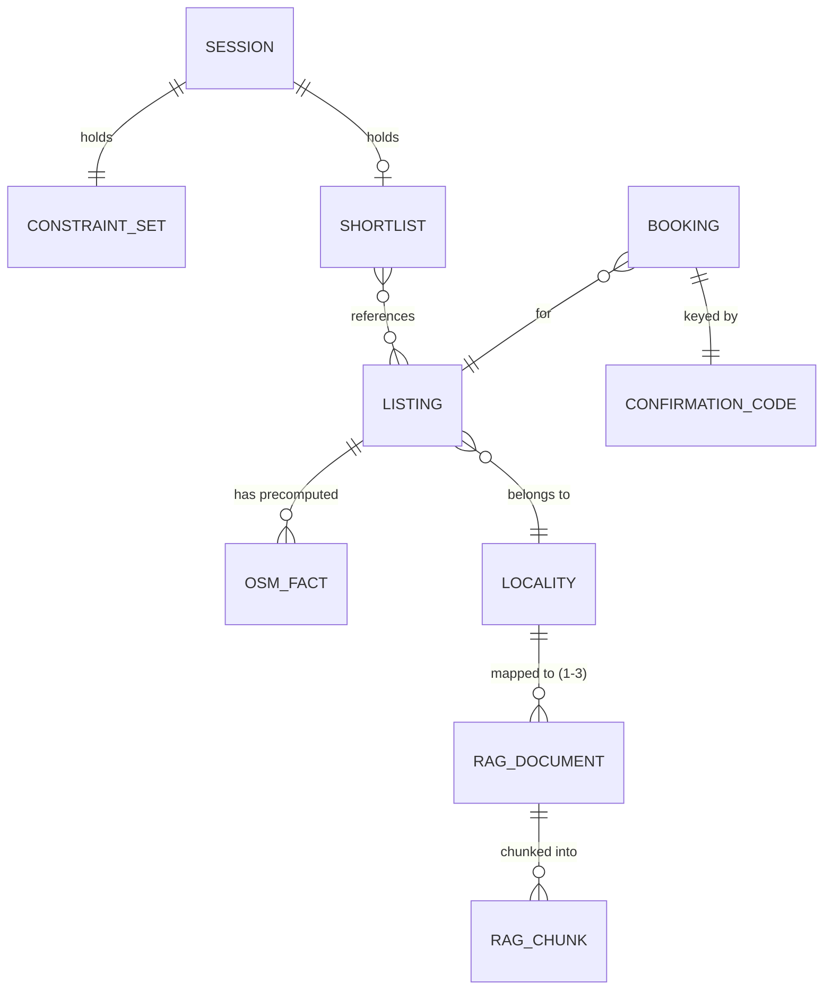
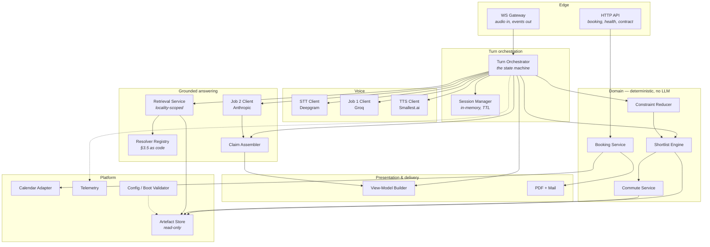
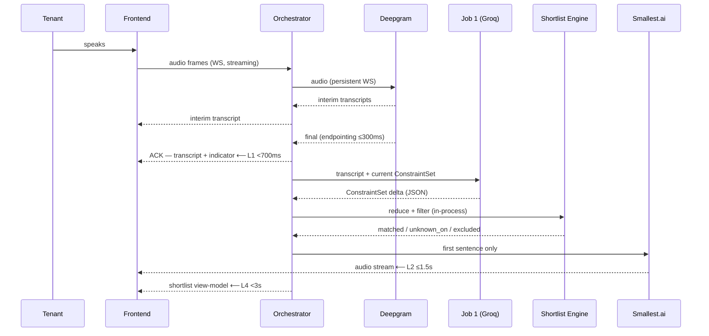
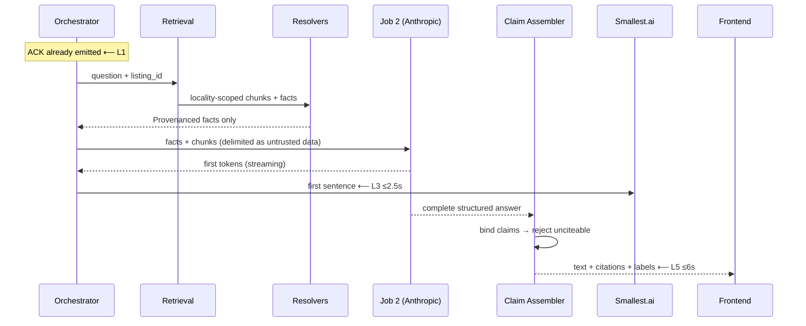
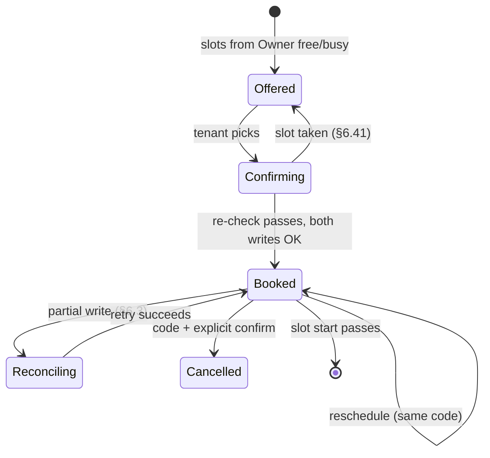

# Architecture — Voice-based AI Property Scout, Bengaluru

**Companion to [`Problem_Statement_Detailed.md`](./Problem_Statement_Detailed.md) (v3.9), which governs.** The specification says *what the system must do and why*; this document says *how it is structured to do it*. Where a structure here is a design decision rather than a restatement of the spec, it is marked **[AD-n]** and listed in §12 with the alternatives rejected.

The architecture is shaped by one observation: **almost every requirement in the specification is a constraint on provenance or on timing.** Claims must name their source and method; numbers must name how they were computed; failures must be distinguishable from empty results; and a handful of operations must complete inside a few hundred milliseconds. A design that treats those as conventions will violate them. This architecture makes them *types and boundaries* — things the compiler and the test harness can see.

---

## 1. Architectural principles

These are derived from the specification and decide every structural choice below.

| # | Principle | Consequence in the design |
|---|---|---|
| **A1** | **Provenance is carried by the value, not by convention.** | No bare numbers cross a module boundary. Every fact is a `Provenanced<T>` (§4.1) carrying source, method and as-of date. A commute distance without a method label is **unrepresentable**, not merely discouraged |
| **A2** | **The grounding boundary is enforced structurally.** | One resolver per claim type (§5.4). The explanation assembler can only reach facts through resolvers, so §3.5's table becomes a call graph rather than a prompt instruction |
| **A3** | **Anything resolvable before a turn is resolved before a turn.** | Scrape, RAG index and OSM facts are build-time artefacts. The runtime is **closed-world**: no scraping, no retrieval fetching, no OSM calls inside a tenant turn |
| **A4** | **The LLM never decides what is true or what matches.** | Job 1 parses speech into a `ConstraintSet`. Job 2 phrases facts it is handed. **Filtering, ranking, availability and slot arithmetic are application code** — deterministic, testable, and unaffected by model non-determinism |
| **A5** | **A result and a failure are different types.** | `TurnOutcome` is a discriminated union (§7.1). "Nothing matched" and "couldn't ask" cannot be rendered by the same code path, because they are not the same shape |
| **A6** | **State lives where its lifetime belongs.** | Conversation state is in-memory and dies with the session. Bookings live in Google Calendar. There is no database (§3.4 AD-6) |
| **A7** | **Every externally-observable claim is reachable by the eval harness.** | The view-model is a published contract package consumed identically by the UI and by Suite C, so assertions run on the same structure the tenant sees |

---

## 2. System context



**Two things to read off this diagram.** First, the tenant's browser touches exactly one origin — every provider call originates on Railway (§5.4). Second, `bengaluru.rent`, the OSM MCP and Wikipedia are reached **only by the build pipeline**, never by the backend. That is A3 drawn as an edge that does not exist.

---

## 3. Container view

| Container | Runtime | Responsibility | Never does |
|---|---|---|---|
| **Frontend** | Vercel, static/SSR | Renders view-models; captures microphone; plays streamed audio | Holds keys; calls providers; contains API routes; computes a fact |
| **Backend** | Railway, one long-lived process | Turn orchestration, both LLM jobs, retrieval, shortlist engine, booking, PDF/mail | Renders markup; fetches from source sites at runtime |
| **Build pipeline** | Operator's machine or CI, offline | Scrape → curate → gap-report → index → OSM precompute → manifest | Run during a tenant turn |
| **Artefact bundle** | Files, versioned with the repo or a release | Dataset, RAG index, OSM facts, manifest | Change without a version bump |

**[AD-1] The build pipeline is a separate container, not a backend startup task.** Its outputs are versioned artefacts the backend loads read-only. This makes the dataset reproducible, keeps §9.1's gap report a first-class deliverable, and means a scrape failure can never take the service down mid-demo.

---

## 4. Data architecture

### 4.1 The provenance wrapper — the type that makes A1 real

Every fact that can reach a tenant is wrapped. This is the single most load-bearing structure in the design.

```
Provenanced<T> {
  value:   T | null          // null is a real, displayable value (§3.1)
  source:  DATASET | OSM | RAG | COMPUTED | NONE
  method:  null | ROUTED | STRAIGHT_LINE          // required when the value is a distance/duration
  timing:  PRECOMPUTED | LIVE                     // precomputed-vs-computed-now (§2.3)
  as_of:   date | null                            // index date for PRECOMPUTED
  citation_ref: CitationId | null                 // resolves in the Sources section
}
```

**Why this and not a plain number with a label beside it:** §7.2 makes an unlabelled distance an automatic failure, and §2.3 makes a *disagreeing* label worse than either error alone. If the number and its label are separate fields, keeping them in step is a discipline that fails eventually. Wrapped together, a renderer physically cannot emit the number without reaching through the object that carries the method. `null` is inside the wrapper too, so "not stated" travels with its reason rather than degrading to a blank or a zero.

**Rendering rule.** The formatter takes a `Provenanced<Distance>` and returns both the card badge and the full label from the *same* object. Suite C's three-layer assertion (§7.1) therefore checks three renderings of one source of truth rather than three independent code paths.

### 4.2 Core entities



**`Listing`** — §3.1's 18 fields, each a `Provenanced<T>` with `source: DATASET`. Plus `listing_id`, `locality_id`, and `dedup_merged_from` (§3.1's 50 m merge rule).

**`OsmFact`** — `{listing_id, query_key, value: Provenanced<T>}` where `source: OSM`, `timing: PRECOMPUTED`, `as_of: <index date>`. The **query key comes from the fixed query set** (§3.4), so coverage is uniform by construction: every listing has a row for every key, `null` where OSM returned nothing.

**`RagChunk`** — `{chunk_id, locality_id, text, source_title, source_url, retrieved_at}`. `locality_id` is not metadata; it is the **retrieval partition key** (§5.5).

**`ConstraintSet`** — the tenant's requirements as a value object: hard filters, soft preferences, the commute point, and a per-field `confirmed: bool`. Immutable; each voice edit produces a new one (§5.6).

**`Booking`** — `{code, listing_id, slot (IST), state, tenant_event_id, owner_event_id, email}`. State machine in §8.

**`DatasetManifest`** — the artefact that makes the build auditable: locality list with per-locality counts and total, the availability marker found, the **field-availability gap report**, the curation rule applied, the OSM query set, and the index date. §7.3 requires publishing exactly this; making it a build output rather than a written-up afterthought is [AD-2].

### 4.3 What is *not* stored

No listings database, no transcript store, no PDF store, no user table. §3.2 strips PII before the dataset exists; §2.5 discards the PDF after sending; §5.3 makes sessions ephemeral. **The absence of storage is a design feature and should be preserved** — adding a database later reintroduces every retention question the spec closed.

---

## 5. Backend component architecture



### 5.1 Turn Orchestrator — the one place that knows the shape of a turn

A single state machine per session:

```
IDLE → CAPTURING → TRANSCRIBING → [ACK emitted ≤700ms]
     → CLASSIFYING → (TYPE_A | TYPE_B) → SPEAKING → IDLE
```

It owns the **latency checkpoints**. `ACK` is emitted the moment the final transcript is rendered and the processing indicator is up — **before any LLM call**, which is what makes L1 achievable at all (§5.2 L1 says explicitly that no LLM call may sit inside it). Barge-in (§6.17) is a transition from `SPEAKING` back to `CAPTURING` that cancels the in-flight TTS stream and, if it is still running, the Job 2 call.

**[AD-3] Turn classification is a cheap deterministic router, not a model call.** Explanation intents ("why", "what's the area like", "is the commute realistic") are matched by pattern against the current shortlist context before Job 1 runs. An LLM call to decide which LLM to call would consume the L1 budget twice.

### 5.2 Session Manager

In-memory map, TTL-expired, one lock per session. Holds the `ConstraintSet`, the current `Shortlist`, the **last-spoken ordering** (needed for §6.30's "the second one", which resolves against what the tenant *heard*, not the current internal order), the clarifying-question counter (max 5, §2.1), and the audio-arming state.

Stateless-demo semantics (§5.3) mean a second tab is a second session (§6.22) and a refresh loses the conversation (§6.21) — both fall out of this design rather than needing special handling.

### 5.3 Shortlist Engine — deterministic, three-way partition

Pure function: `(ConstraintSet, Listing[]) → Shortlist`. It returns **three groups, not one list**:

| Group | Meaning |
|---|---|
| `matched` | Every hard constraint satisfied |
| `unknown_on` | A required field is `null` for this listing — §3.1's rule that null neither matches nor is silently dropped |
| `excluded` | Failed a hard constraint (retained with the reason, so §6.1's empty state can name the *binding* constraint) |

Keeping `excluded` with reasons is what lets the zero-result state say "nothing under 25k in Koramangala" instead of "no results". Ranking is stable and separate from grouping, so §4's locality grouping is presentation only and Suite B's byte-identical-order requirement holds.

### 5.4 Resolver Registry — §3.5 as a call graph

```
ClaimType.LISTING_FACT   → DatasetResolver   (only source; null if absent)
ClaimType.AMENITY_TRANSIT→ OsmFactResolver   (precomputed store only)
ClaimType.NEIGHBORHOOD   → RagResolver       (locality-scoped, citation required)
ClaimType.OTHER          → UnavailableResolver → declares unavailable
```

**Job 2 has no access to any data except through a resolver's output**, and every resolver returns `Provenanced<T>`. This is A2: the grounding boundary is a dependency rule, not a sentence in a prompt. A resolver that would need to invent a value returns `null` with `source: NONE`, which the assembler renders as an explicit gap.

### 5.5 Retrieval Service — partitioned, not filtered

Retrieval takes `locality_id` as a **partition key**, not a post-filter. The index is keyed so that a query for listing X can only ever see X's locality's chunks. Cross-locality contamination (§3.3, §7.1) is then structurally impossible rather than statistically unlikely — and the two contamination probes in Suite C test the partitioning, not the model's restraint.

**[AD-4] Retrieval is local and in-process** — the corpus is a few dozen documents, so an in-memory vector index loaded at boot beats a network-attached vector database on latency, operational surface and the L3 budget.

### 5.6 Constraint Reducer

`(ConstraintSet, Edit) → ConstraintSet`, applying Job 1's parsed edit as a **field-level change**. Cumulative by construction (§2.2). Contradiction detection is a check on the resulting set — if a new bound is unsatisfiable against an existing one, it returns `NeedsClarification` rather than a new set (§6.5). Immutability is what makes Suite B's before/after comparison meaningful.

### 5.7 Commute Service

Two paths, matching §3.4's two timings:

- **Listing-anchored** → read the precomputed `OsmFact`. No network call.
- **Tenant commute point** → **haversine over stored coordinates: local arithmetic, zero network cost**, returning `Provenanced` with `method: STRAIGHT_LINE, timing: LIVE`. MCP routing is an opt-in path gated on the latency budget.

The service **cannot return a distance without a method** — that is the wrapper doing its job.

### 5.8 Claim Assembler & View-Model Builder

Job 2 returns structured output: a list of `{text, claim_refs[]}` rather than free prose. The assembler binds each `claim_ref` back to the `Provenanced` fact that produced it and **rejects any claim whose reference does not resolve** — an unciteable sentence never reaches the tenant. The View-Model Builder then renders card, panel and Sources entries from those same objects, which is what makes Suite C's "all three layers name the same method" assertion structurally guaranteed rather than tested-and-hoped.

---

## 6. Turn lifecycles

### 6.1 Type A — preference or refinement (Groq only)



### 6.2 Type B — grounded explanation (adds Anthropic)



**Note the ordering:** TTS begins on Job 2's *first sentence* while the claim assembler is still working. L3 is a first-byte budget; L5 is a rendered-text budget. They are deliberately different clocks.

---

## 7. Error architecture

### 7.1 Two axes, one union — how §6's 58 rows become code

```
TurnOutcome =
  | Answered   { view_model }
  | Empty      { unmet_constraints[], suggested_relaxations[] }   // a RESULT
  | Degraded   { partial, missing_capability, reason }            // partial answer
  | Failed     { capability, user_message, retryable }            // an ERROR
  | NeedsInput { question, field }
```

`Empty` and `Failed` are **different variants**, so §6.0's principle 2 — that "nothing found" and "couldn't ask" must never look alike — is enforced by exhaustive matching in the renderer, not by remembering to write two different strings. Adding a new failure without a user-facing message becomes a compile-time or lint-time error.

`capability` names *which* subsystem is down (`STT`, `EXTRACTION`, `EXPLANATION`, `TTS`, `CALENDAR`, `MAIL`), which is what §6.23 and §6.11 require: the tenant is told which capability failed, not given a generic error.

### 7.2 Degradation matrix

| Down | Shortlist | Explanation | Booking | Voice out |
|---|---|---|---|---|
| **Deepgram** | ✗ turn cannot start | ✗ | ✗ | — |
| **Groq (Job 1)** | ✗ | — | ✗ | — |
| **Anthropic (Job 2)** | ✓ (code-produced) | ✗ withheld, never substituted | ✓ | ✓ |
| **Smallest.ai (TTS)** | ✓ | ✓ | ✓ | ✗ → text |
| **Google Calendar** | ✓ | ✓ | intent recorded, reconciled | ✓ |
| **Gmail** | ✓ | ✓ | ✓ code stands | ✓ |

The two-provider split earns its second key here: Job 2's outage costs one capability, not the demo. **Falling back from Job 2 to Job 1 for explanations is forbidden** (§6.11) and is enforced by the resolver/assembler path being wired to one client only.

### 7.3 Boot validation

A `BootValidator` runs before the port opens: every secret present, dataset and index loaded and internally consistent, manifest version matching the contract version, OSM facts covering every listing × query key. **Any failure exits non-zero** (§6.35, §6.55) — Railway's healthcheck catches it, not a tenant mid-sentence.

---

## 8. Booking subsystem

### 8.1 State machine



### 8.2 Four mechanisms that carry the correctness

- **Confirm-time re-check.** Free/busy is re-read at confirmation, never trusted from offer time (§6.41). This is the guard for concurrent sessions (§6.42) — the loser is re-offered, and neither tenant is told a booking exists that does not.
- **Parallel dual write with a reconciliation outbox.** Both calendar writes are issued concurrently (P6). A partial success enqueues the missing side for retry while the **tenant's intended state is already authoritative** (§6.0 principle 6). Reschedule is four calls; without parallelism L7 depends on Google's latency multiplied by four.
- **All arithmetic in `Asia/Kolkata`.** Slot boundaries, the 7-day window and the "already started" check take an explicit timezone. The backend region is deliberately outside India (§5.4), so **any use of server-local time is a live bug** (§6.47). A lint rule banning naive datetimes is worth the five minutes.
- **The code is the credential.** Rate-limited lookups; unknown and cancelled codes return **identical** responses so the endpoint cannot enumerate bookings (§6.45). The spec is explicit that this is a demo-scope limitation, not a solution.

---

## 9. Frontend architecture

```
app/
├── audio/          AudioWorklet capture · playback · barge-in · autoplay arming
├── transport/      WS client (reconnect, backoff) · HTTP client · contract check
├── viewmodels/     types from the shared contract package — no derivation here
├── components/     cards · snapshot panel · sources · mic · booking · states
└── state/          session store (ephemeral, mirrors backend)
```

**[AD-5] The frontend derives nothing.** It receives view-models and renders them. No distance formatting, no method labels, no "not stated" substitution in the UI layer — all of that arrives pre-decided from the backend. This is what makes Suite C's view-model assertions sufficient without screenshot tests: if the assertion passes on the view-model, the only remaining way to get it wrong is a rendering bug in a component that has no logic in it.

**Audio specifics that the spec's error rows demand:** playback is armed by the tenant's own click on the mic control (§6.15's autoplay unlock); the worklet keeps capturing during playback so barge-in is detectable (§6.17); `visibilitychange` pauses capture without signalling end-of-speech (§6.16).

---

## 10. Cross-cutting concerns

### 10.1 Observability

One span per turn, child spans per component, matching §5.2's measurement rules exactly: `stt.final`, `retrieval`, `llm.first_token`, `llm.last_token`, `tts.first_byte`, and one per external call. Each span carries `turn_type` so latency is scored per type (§7.2). **Cold start is its own counter**, never averaged into the budget (§6.56).

Logs carry no PII and no transcript text (§3.2, §5.3) — span names and durations, not content.

### 10.2 Prompt-injection containment

Untrusted text (listing fields, RAG chunks) is passed inside explicit delimiters with a standing instruction that content within them is data. Two structural reinforcements matter more than the wording: Job 2 **cannot act** — it has no tools and no write path — and the claim assembler **discards any sentence without a resolvable citation**, so injected instructions have no route to the tenant even if the model were momentarily swayed.

### 10.3 Configuration and secrets

All five credentials are Railway environment variables, validated at boot. Model IDs are **pinned exactly, never aliased** (§5.1) and live in config so the pinned pair is visible in the deployment record. The frontend gets one public value: the backend URL.

### 10.4 Connection management

One long-lived process holding: a persistent Deepgram WebSocket, and keep-alive pooled clients for Groq, Anthropic, Google and Smallest.ai (P2). This is precisely why no part of the pipeline may run as a serverless function — a per-invocation runtime cannot hold any of it.

---

## 11. Eval harness architecture

```
evals/
├── fixtures/     frozen dataset slice · frozen RAG chunks · frozen OSM facts
├── harness/      turn driver (text in, view-model out — no audio)
├── suites/       a_feasibility · b_edit_correctness · c_grounding
└── assertions/   view-model matchers · provenance matchers · order matchers
```

**[AD-6] The harness drives the orchestrator directly, bypassing STT and TTS.** Suites A–C test extraction, filtering and grounding; putting real audio in the loop would add non-determinism the 3×-green requirement cannot tolerate. STT normalisation cases are asserted at the constraint-extraction layer, exactly as §7.1 specifies. Latency, by contrast, is measured on the *full* path including audio.

Determinism comes from pinned model IDs, `temperature=0` on Job 1, structured outputs on both, and frozen fixtures. Job 2 has no sampling parameters available, which is precisely why the 3-run rule exists.

---

## 12. Architecture decisions

| # | Decision | Alternatives rejected |
|---|---|---|
| **AD-1** | Build pipeline as a separate offline container producing versioned artefacts | Scrape-on-boot (a source outage takes the service down; the dataset stops being reproducible) |
| **AD-2** | `DatasetManifest` as a build output | Writing the §7.3 artefacts by hand at sign-off — they drift from what was actually built |
| **AD-3** | Deterministic turn-type router before Job 1 | An LLM classifier (spends the L1 budget twice) |
| **AD-4** | In-process vector index | Hosted vector DB (network hop inside L3 for a corpus of dozens of documents) |
| **AD-5** | Frontend derives nothing; view-models arrive complete | Formatting in the UI (puts the method label two codebases away from the number, which is how the labels drift apart) |
| **AD-6** | Eval harness bypasses audio | End-to-end audio in CI (non-determinism against a 100%×3 bar) |
| **AD-7** | No database | Postgres/Redis for sessions and bookings (reintroduces retention questions §2.5/§3.2/§5.3 deliberately closed; the calendar is already the booking's system of record) |
| **AD-8** | **Python backend (FastAPI + asyncio), TypeScript frontend (Next.js)** | Node backend — a single language across both tiers is genuinely attractive, but the build pipeline is data work, the OSM MCP ecosystem is Python-first, and both LLM SDKs are first-class in Python. **This is the one choice here the specification does not constrain**; if the team is stronger in TypeScript, a Node backend satisfies every requirement in this document except the MCP integration convenience |

---

## 13. What this architecture defers

Honest boundaries, so nothing here reads as more settled than it is:

- **Gate D (§9.1) can change §4's data model.** If bengaluru.rent publishes fewer fields than §3.1 assumes, the schema, the card layout and Suite A's coverage all move. The provenance wrapper absorbs this well — a missing field is a `null` with `source: DATASET` — but the filter vocabulary is genuinely dependent on the scrape.
- **Gate L (§9.2) can change §5 and §6.** If the measured budget misses, the Job 1 model, the region, or the targets change. The component boundaries are drawn so that swapping the Job 1 model is a client-config change, not a refactor.
- **Concurrency is bounded by provider rate limits, not by this design** (§6.57). The single-process model is a demo-scope decision; the state that would need to move for horizontal scaling is exactly one thing — the in-memory session map.
- **Nothing here is measured.** Like §5.2's budget, this document is derived from the specification, not from a running system. The first thing that should update it is Gate L's numbers.
