# Architecture — Voice-based AI Property Scout, Bengaluru

## 1. Preface

**The problem.** Renters do not struggle to *find* listings. They struggle to judge whether a listing fits their life — is the commute realistic, is the area safe, is the extra room worth the extra rent.

**The system.** A voice-first AI property scout for **Bengaluru only**. You talk to it. It collects your preferences by voice, shortlists real listings scraped from bengaluru.rent (**up to 10 per area** — the specification's word is *locality* — a ceiling, not a target), explains every choice and names a source for it, and books a site visit on Google Calendar for both you and the owner.

**The five things it must do:**

1. Collect your preferences and **read them back to you for confirmation** before shortlisting (at most 5 clarifying questions).
2. Change the shortlist when you ask ("drop anything above 40k") **without disturbing the listings you did not mention, or their order**.
3. Explain each choice, with a source for every neighbourhood claim — and say plainly when it has no data.
4. Book, cancel and reschedule visits, using a **6-character code** instead of a login.
5. Email a PDF confirmation, then throw the PDF away.

---

## 2. The big picture

### 2.1 Who talks to what

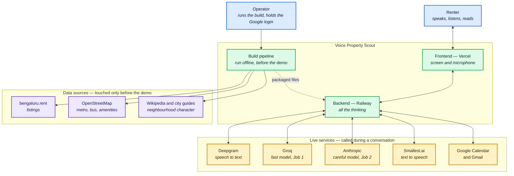

<sub>[⤢ Open this diagram in a canvas](https://mermaid.live/view#pako:eNp9Vdtu2zgQ_RVCAfqkpL4kDmoEBuI4FrK5NXaaoFjtw4gcWYQpUktRuaDtv3coRa4cIyUMQaR4Ds-cmaF_BNwIDMZBqswzz8A6dj-NNaNx_28cLFA7tCeJ_Tw5kZOyQFiXIVOydKjpxSKI8uSznMTBfw3o9iuhbgu04MwGZytdMpchSyqpRMgyo0SzEBmzUsiUWUm94WmYyipZWSgytvy-JM4HIzmyr9YQt3tlS24qtznVDyEtcieN3gTgx_ycsHNrKAwtWFwNev1D9oCWo9pExS2iZkDfc8npgMxo3ArKj6knmgJfd3gWINUzvLZEoFQdlMukXku92uX4dnE18zTeBlbIApWko_64xEya-qWQJZgaizWdwNxsUZGCHZOuLh68wCv5hKxE-0Rmla1MTsJQMFFZEsWAcaOf0JbgzdrSN4uIYoZYEGfeSTryjDnDHL64nZiiO8JE1vzf7k-hdCynolIh-8ckrL8DOb0hyKl2GXkteYvjYDGtVBc62IEurwm6zH1ApTsA2YK9NC-xEbsr8syLbGrtDBQZCE1x-qRHOaXxr-bezudXFzfe3xk4YKWpbMdeZyqekb9Gq9f3edtO_4IYEtQrUJWtDiz1VqvfdxQlp9xRfltHTA2ll47K1F1D0WJydNZQpVTUiJCjlk7iLsHjJeEf5ZqKTUioq5xLaqBVJQVtf-PSKFdZQnFlxtAGugeA-8b_oOzu2cn-_oSaq5nOz5v59Ly9BFg99eXerNSvzeKCffJR0fPxcuvjwf7kZxwU1GKwIjtTSTmOg58b1unbKbOIsNEdPU5v6FFTRWetNK6gLGeYMronSroMiEaN90SCkGJYkmNrHO8NjkZDTN6m-89SuGw8KF5CbpSx471e0k-G8I6PzClbNp5yPN6w9UcwPISP2Y4G2B-9Y1O-URu2FNMh_8Mmvhwf90Yfsh0e9aE3fK-tuTbeCFHgl06wx3wIKD4kJHG90VGHkN2HlMDGvu7y_Dyc0q9Oljej-20WhdFdeHoTLq_D6KyOrvt5uggp5eHjZas0CIMcLTWeoL-eH3FA_ZJjHIxZHAhMoVJ0t_-iTVA5s3zVPBg7W2EYVIUAhzMJ_oZqFn_9BgZmId8) — zoom, pan and export</sub>

**Two things to notice.**

- The browser talks to **exactly one address of ours** — the Railway backend. Every call to a paid provider starts there, which is what makes "the keys never leave the server" true by construction rather than by good intentions.
- The purple boxes are reached **only by the build pipeline**, never by the backend. There is no arrow from the backend to `bengaluru.rent`, and that missing arrow is the whole of principle **A3** (§17): nothing is fetched while you are waiting.

### 2.2 The three moving parts

| Part | Where it runs | What it is responsible for | What it must never do |
|---|---|---|---|
| **Frontend** | Vercel | Draws what the backend sends it; captures the microphone; plays the audio stream | Hold a key, call a provider, run an API route, or work out a fact for itself |
| **Backend** | Railway — **one process that stays awake** | Runs the conversation, both model jobs, retrieval, filtering, booking, PDF and email | Fetch from listing sites or OpenStreetMap while a renter is waiting |
| **Build pipeline** | The operator's machine or CI, **offline** | Scrape, curate, gap-report, build the RAG index, precompute OpenStreetMap facts, write the manifest | Run during a conversation |
| **Artefact bundle** | Plain files, versioned alongside the code | The dataset, the RAG index, the OpenStreetMap facts, the manifest | Change without a version bump |

**[AD-1] The build pipeline is a separate program, not something the backend does at start-up.** It writes versioned files that the backend only ever reads. This keeps the dataset reproducible, makes the field-availability gap report (spec §9.1) a real deliverable, and means a scrape failure can never take the service down in the middle of a demo.

### 2.3 One conversation, end to end

```mermaid
flowchart LR
    A["<b>1. Speak</b><br/>microphone to<br/>live transcript"] --> B["<b>2. Understand</b><br/>fast model turns words<br/>into requirements"]
    B --> C["<b>3. Choose</b><br/>plain code filters<br/>and ranks listings"]
    C --> D["<b>4. Explain</b><br/>careful model phrases<br/>facts it is handed"]
    D --> E["<b>5. Book</b><br/>free slot, two calendar<br/>entries, 6-character code"]
    E --> F["<b>6. Confirm</b><br/>PDF emailed,<br/>then deleted"]

    classDef s1 fill:#dbeafe,stroke:#2563eb,stroke-width:2px,color:#0b1b3a
    classDef s2 fill:#cffafe,stroke:#0891b2,stroke-width:2px,color:#083344
    classDef s3 fill:#dcfce7,stroke:#16a34a,stroke-width:2px,color:#052e16
    classDef s4 fill:#fef3c7,stroke:#d97706,stroke-width:2px,color:#451a03
    classDef s5 fill:#ffe4e6,stroke:#e11d48,stroke-width:2px,color:#4c0519
    classDef s6 fill:#ede9fe,stroke:#7c3aed,stroke-width:2px,color:#2e1065
    class A s1
    class B s2
    class C s3
    class D s4
    class E s5
    class F s6
```

<sub>[⤢ Open this diagram in a canvas](https://mermaid.live/view#pako:eNp11EtvozAQAOC_MqLXJA3hkQZVkZpHT3tYbbWnzR6MPS5Wjc3aZtNV1f--U6AURQonxqBvHja8RdwKjIpIanvmFXMBvv04GaDr4dcpui-38QKeGmQv97fl9r50t9tacWebyhqEYLsVrf7SvWPGc6eacIp-w3y-hV0PrBbw0wh0PjAjRkUyH6Cm3BpC64yHs3XCd4-UCRYc_mmVwxpN8AT2Je06d9-7yQL2lbUeR7PRTBn4aAik0oFSdsuUFqi4Fw9a-aDM8xe478BDD6YLOL52xihy5lC2eii0qRzz6If6efCgAigPFWVAMaKHDj32aLaAnbVf05MOEby2YQbhbIEzjUYw1z2jXp1CP4N8_rEVlAFd185IHzv6sadzGoA1Url61L8fHgFrpjSKWbcQKjRAtWMYCuwdrpn3B5Tg449R6eJGlMgkznxw9gWLm1WWJ1gO4fysRKiKVfM641ZbV9wsy7hM2KW1Giwu5dRa3m3icnXdukuSNL20ks-6uOS4Hq04Z0nKrlvZCuP80koHS6JM-JclNuv1Mr9qpVnMlsmllX1aElPMRwvjWKR31y2-zOLNpZUPFgrcTOa15gmj_btmUYfLPJtY8EDbOI13tBXTeE_jnMYHGsk0PlJb0_iRSotmUY2OjpKgn8PbKaKDVNM5LOAUCZSs1fSZv9NLrA326Z_hURFci7OobQQLeFDs2bG6X3z_Dwgdarg) — zoom, pan and export</sub>

Steps 3 and 5 are **ordinary code, not a model**. That is deliberate: filtering, ranking, availability and slot arithmetic have right answers, so they are written as functions that can be tested, not asked of a model that might answer differently next time (**A4**, §17).

### 2.4 Two kinds of turn

Everything said to the system is handled as one of two turn types. They have different speed budgets because they call different providers.

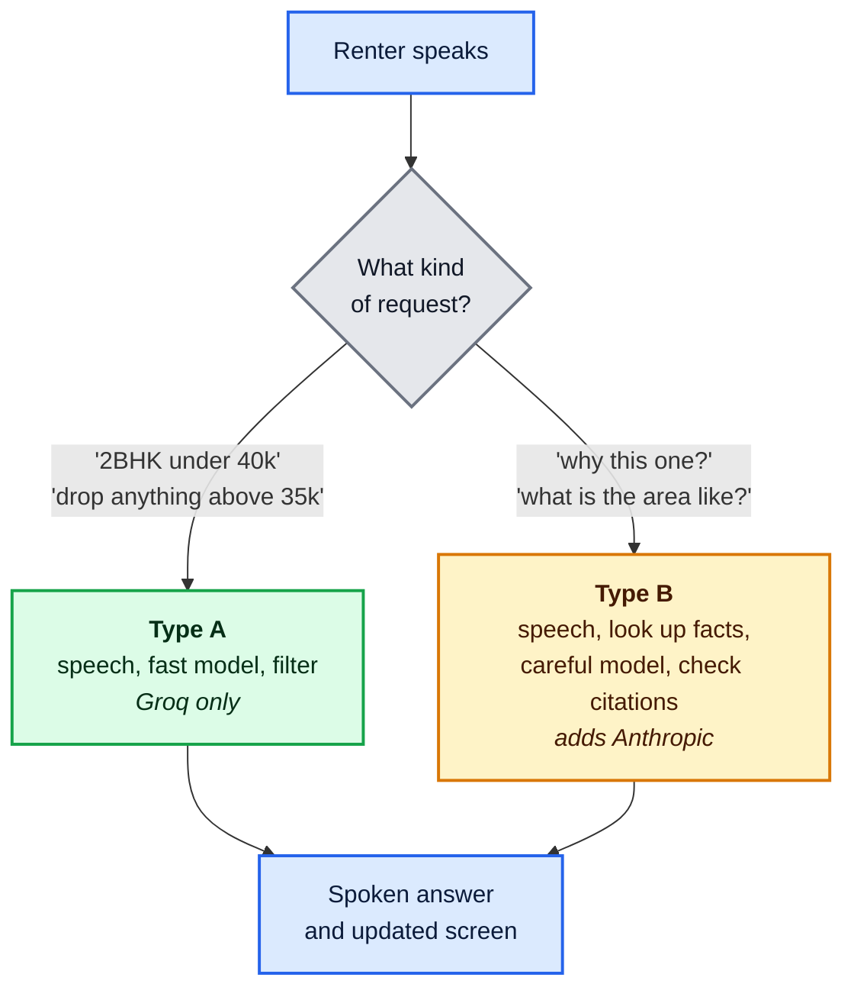

<sub>[⤢ Open this diagram in a canvas](https://mermaid.live/view#pako:eNp1k99v2jAQgP-Vk3ngJaiEX-kiRAWqtEl7mEqZ9rDs4WJfmijBDrYzhtr-7z0CtJSJPCVn33ffneNnIY0iEYusMluZo_WwWiQa-Hn4nYglaU8WXE1YukT8gV5vBsvnRPzK0UNZaDVN7c3MZGBp05Dzd4l4PaQv93tfEtEdLL59h0Yr5oz6ZbdN6CprakC983mhnwBT85dgOC67iXiB1ZwrT9PZalcTzKc36azNYQmSeQAZOg9rtq74vajYr12eFrOv1mzA6Go3vSlmbHshss13wPUcb6G7o8d23weHfE6AlhCqouTFVmNxprH4T6MypoSmZh3pXdAuSSZkTXWSkznJEmTh0RdGu5MlKuVgrn3OIyjkJ9XVvB3wj58rLv1Ym5I0D8ltjy2iVlxRoScFTloi_ZG5OGUm-hCRFTp3Txls9lOq4o5KCTMKnLfMjTuD8WRI6fGzty2Uz-NB_S-QpjI27vTTMB3iBUqRPMJoTNF7dtyZpNHgtn8VFobh7SC6gHk8iclMUvTOCic4HOF1sfGAwsklKz2yMsqG8oOlvkRRf3KVNRqH2B-eseAh4BHC5jy03Ld9HuBT8vgpsGABEYg12TUWim8T3xD-o9aUiBgSoSjDpvJ8NXgTNt487rQUsbcNBeJwoPcFPllcH4Kvb5O3KF4) — zoom, pan and export</sub>

The router that picks between them is **pattern matching, not a model call** — see [AD-3] in §7.2.

### 2.5 Where the time goes

Budgets are p99: 99 turns out of 100 must come in under them. An average that meets the target is not a pass.

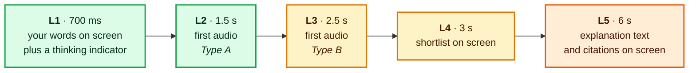

<sub>[⤢ Open this diagram in a canvas](https://mermaid.live/view#pako:eNqF0stuozAUBuBXOXK2pOEapgghteoyq053wyxO7ONiFTCyjZKo6ruPB5iWRKrGO_-2P9_OO-NaECuYbPWJN2gcHJ7rHnw7RL9qVh6rQ1TujhXUYxgec8jDEDpbHs2uuujRwEkbYUH3YLkh6qeBoR0tILhG9W-qfwXVC8XRaVOz37DdVnCIFzpe09FdBrMslbEOcBRKT_1SVS-XgeCh3KnKI8sB4xlLFixZY_F_scdrLJmxdMHSNZYslG20ca3y3OeFv4B0BrIFyNbAfgHoPLTYo1N-vaOzm0LsBXDlptTeyLPNW7T2iSRI9HtL1bbFRnDJKQ-sM_qNik20xyTFpbs9KeGaIh7OAdetNsUmzGKK9jdap8SCSZIJ_8LEfZ6H-2-xNIswTG4w6wvonyZJiOxTI8x-hPx7LYnSMF9pvvIC_7d_73qVJoF_Y3_mqzCbNmYB68h0qIQv5feauYY6qlkBNRMkcWxdzT78JByd_nnpOSucGSlg4yDQ0ZPCV4PdHH78ATVl97c) — zoom, pan and export</sub>

| # | Stage | Budget |
|---|---|---|
| **L1** | You stop speaking, and your words appear with a thinking indicator | **< 700 ms** |
| **L2** | First audio out — Type A | **≤ 1.5 s** |
| **L3** | First audio out — Type B | **≤ 2.5 s** |
| **L4** | Shortlist drawn | **< 3 s** |
| **L5** | Explanation **text and citations drawn** (not audio finished) | **≤ 6 s** |
| **L6** | Booking confirmed: both calendar entries written, code shown | **< 5 s** |
| **L7** | Cancel or reschedule | **< 5 s** |
| **L8** | PDF emailed | **< 30 s** |

**How long the audio plays is never a target** — that depends on how much there is to say, not on how fast the system is.

**The seven conditions the budgets depend on** (spec §5.2). If any one of these is not true, the numbers above are void:

| | Condition | Where this document keeps it true |
|---|---|---|
| **P1** | The process stays awake — no sleeping, no serverless | §2.2, §13.6 |
| **P2** | Connections are reused, not reopened per request | §13.6 |
| **P3** | Deepgram declares end-of-speech within 300 ms | §7.2 |
| **P4** | Speech synthesis starts on the **first sentence**, not the finished answer | §7.4, §9.5 |
| **P5** | OpenStreetMap facts are precomputed | §3, §8.3 |
| **P6** | The two calendar writes go out at the same time | §10.2 |
| **P7** | The careful model's thinking effort is set explicitly | §13.5 |

### 2.6 How the rest of this document is organised

It follows the order in which the work actually happens — from the data gathered before anyone speaks, through a live conversation, to running and testing the thing.

| # | Section | What it covers |
|---|---|---|
| 1 | **§3 · Before anyone speaks** | The offline build pipeline: scraping listings, curating them down to ten per area, reporting which fields the source actually publishes, indexing the neighbourhood documents, and precomputing every map fact. Everything the system can ever say is collected here. |
| 2 | **§4 · How a single fact is carried** | The wrapper that every fact travels in — value, source, method, freshness, citation. The smallest structure in the design and the one that makes "say where it came from" impossible to forget. |
| 3 | **§5 · What is stored** | Everything the system knows about — areas, flats, map facts, guide passages, the renter's requirements, bookings, the build record — grouped by how long each one lives, and the deliberate absence of any database, transcript store or PDF store. |
| 4 | **§6 · The backend, part by part** | The three paths through the backend — the conversation, booking, and the support layer beneath both — and the full list of components with the one job each of them has. |
| 5 | **§7 · Listening and understanding** | Turning speech into text and text into requirements: the turn state machine, the 700 ms acknowledgement, how interrupting works, what the system remembers between sentences, and a Type A turn walked end to end. |
| 6 | **§8 · Choosing the listings** | How requirements accumulate without disturbing what was already agreed, why filtering returns three groups instead of one list, how distances keep their method label, and the one listing fact that can change at runtime. |
| 7 | **§9 · Explaining, with sources** | The four stages behind every "why this one?" — area-partitioned retrieval, one resolver per kind of claim, the careful model phrasing facts it was handed, and the assembler that drops any sentence it cannot cite. |
| 8 | **§10 · Booking, cancelling, rescheduling** | The states a booking moves through, the four mechanisms that keep it correct (confirm-time re-check, parallel writes, explicit IST arithmetic, the code as the only credential), and what happens on confirmation. |
| 9 | **§11 · What the renter sees** | The frontend, which works nothing out for itself: it draws finished view-models. Also the card rules, the three audio behaviours the browser forces on the design, and the small set of messages that cross the wire between the two hosts. |
| 10 | **§12 · When something goes wrong** | The five shapes a turn can end in and why an empty result and a failure can never be confused, what still works when each provider is down, and why the system refuses to start rather than fail mid-sentence. |
| 11 | **§13 · Running it** | The complete tech stack; deploying two hosts without skew; measuring each turn so a missed budget is diagnosable; keeping scraped text from issuing instructions; where the keys live. |
| 12 | **§14 · Proving it works** | The three test suites, what each one proves, why the harness skips real audio, and where determinism comes from. |
| 13 | **§15 · The decisions** | The eleven design decisions, each with the alternative that was rejected and the reason. |
| 14 | **§16 · What is left open** | The four things this document cannot settle yet — chiefly that neither the scrape nor the latency measurement has happened. |
| 15 | **§17 · Appendix** | The four rules taken from the specification, and the seven principles this architecture adds on top of them. |

Reading in order works, but each section stands on its own; **§4 is the one worth reading first** if you only read one, because almost everything else leans on it.

---

## 3. Before anyone speaks — the build pipeline

Everything the system can ever say is collected **before the demo starts**. Nothing is fetched while a renter is waiting. This is one decision, and it buys three things at once: speed (no network hop inside a turn), reproducibility (the same files produce the same answers), and safety (a source site going down cannot take the demo down).

```mermaid
flowchart LR
    S1["<b>1. Scrape</b><br/>bengaluru.rent<br/><i>strip owner names and<br/>phone numbers here</i>"] --> S2["<b>2. Curate</b><br/>keep up to 10 per area<br/>by a written rule<br/><i>never pad a thin area</i>"]
    S2 --> S3["<b>3. Gap report</b><br/>which fields the source<br/>actually publishes"]
    S3 --> S4["<b>4. Build the RAG index</b><br/>1 to 3 guides per area,<br/>split semantically into chunks,<br/>embedded into ChromaDB"]
    S4 --> S5["<b>5. Precompute maps</b><br/>run the fixed OpenStreetMap<br/>question set for every listing"]
    S5 --> S6["<b>6. Manifest</b><br/>counts, gaps, curation rule,<br/>question set, embedding model,<br/>index date"]
    S6 --> OUT[("Artefact bundle<br/><i>read-only files</i>")]

    classDef step fill:#ede9fe,stroke:#7c3aed,stroke-width:2px,color:#2e1065
    classDef out fill:#dcfce7,stroke:#16a34a,stroke-width:2px,color:#052e16
    class S1,S2,S3,S4,S5,S6 step
    class OUT out
```

<sub>[⤢ Open this diagram in a canvas](https://mermaid.live/view#pako:eNp1k8tu2zAQRX9loGxaQFb8DioYBvIAsmmQImpXURcUObKIUCTLRx0jyL93JCZ20KLaSTO8587l6CXjRmBWZq0ye94xF-DrQ62Bnmr2WGebZjsroOKOWdycN9tN4863DeodU9HFwqEO46eN3PrgpAWz1-hAsx49MC3Gou2MRtCxb9B56NCRlNzW2U-YTLZQzRNnXsB1dCycOE-IFqKFYGA2BUu6zCFLFg7AYO9kCKjBRYXvLjT-pj7LBNVDJ3U6knBvc80TdpGwiwJumQWH1rhwRO87yTtoJSrhSQfBm-h4ojAeIlPqADY2SvoO_Ul7kbSXSXtZwFWUSowKD5e3ILXA5yNkNky2gF2UgtJ6ny8fa94qGcBjz3SQfMRJTe28i_rJpx6kQIVAkSrXnTM9u7k6mVkmM6tkZlXAN4fc9DYGhJ5ZfzTioh4ttvKZ1O4t6io4xHDH7Fj_FdEHaTT5CdAaB0PIB6Dhg9S7E3CVgOsEXBdwx7Rs6eyRxE3UweewI3wOfLjvQXe4wfwfVA5pQmJAT2uqUssYIgjalBN5PZLvf3x__FRnly5gS7cETdTitBqUrZgYTUm2UqFPS_GZFJIGV8z7G2zBB1o7alHlGQr80mJOq22esDy74AuG4u11spcidOXcPufcKOPKsznOpuvVX2omhjcxwVuOF0ex2Zotluy_YtMVya0_iNEPmVfzvFrk1TKvVjnNPDj92EHzD7wsz3p0PZOCfuyXOqOr7SmrEupMUDBRhTp7pSYWg6kOmmdlcBHzLNoh1BvJdo716ePrH8_zWrE) — zoom, pan and export</sub>

**Three rules the pipeline enforces, because nothing downstream can fix them later:**

| Rule | Why it lives here |
|---|---|
| Personal data is removed **before** anything is written to disk | If an owner's phone number never enters the bundle, it cannot leak into the screen, the logs or a transcript later (spec §3.2) |
| Every listing gets a row for **every** OpenStreetMap question, `null` where there was no answer | Coverage is then uniform by construction. "No metro nearby" and "we never asked" stop being indistinguishable |
| Each document chunk carries its area, its title and its URL | Citations become possible at all, and the area tag becomes the retrieval partition key (§9.2) |

**Step 4 in three words that are easy to mix up.** They are not the same thing, and the document uses them precisely:

| Term | What it is | When it exists |
|---|---|---|
| **RAG** | *Retrieval-augmented generation* — **the technique.** The model is never asked what it knows about an area; passages are looked up first, and the model is asked only to phrase those. It is a way of working, not a thing on disk | A behaviour of the system, visible in §9 |
| **RAG index** | **The searchable store** built by step 4, holding every chunk of every area guide | Built here, offline. Loaded read-only at start-up |
| **RAG chunk** | **One piece of one guide document** — a few paragraphs, carrying its area, title and source link. Splitting the guides is what creates them | Created here at build time. Every chunk sits in the index **whether or not any question ever retrieves it** |

So: step 4 *cuts guides into chunks and puts them in an index*. Later, at question time, retrieval *selects a handful of those chunks* (§9.2). A chunk is a stored unit; retrieval is the act of choosing some. In code a chunk is `RagChunk`; in the plain-language tables of §5.1 it is a **quoted passage**.

This index is **closed**: it is built offline and **nothing is added to it, or fetched from anywhere else, during a conversation**.

The bundle is versioned. The backend refuses to start if the bundle's version does not match the contract version it expects (§12.3).

---

## 4. How a single fact is carried

This is the smallest structure in the design and the one that does the most work. **Every fact that can reach a renter is wrapped in it.**

```
Fact<T>                      // in code: Provenanced<T>
  value        T or null     // "not stated" is a real value, not a blank
  source       DATASET | OSM | RAG | COMPUTED | NONE
  method       null | ROUTED | STRAIGHT_LINE   // required for any distance or duration
  timing       PRECOMPUTED | LIVE              // worked out earlier, or just now
  as_of        date or null                    // the index date, when precomputed
  citation_ref id or null                      // resolves to an entry in Sources
```

### 4.1 Why a wrapper instead of a number with a label beside it

A distance shown without saying *by route* or *straight line* is an automatic failure, and a distance where the **spoken words and the on-screen badge disagree** is worse than either mistake alone (spec §2.3, §7.2).

If the number and its label are two separate fields, keeping them in step is a matter of discipline — and discipline fails eventually, usually in the one code path nobody reread. Wrapped together, **a renderer cannot physically reach the number without going through the object that carries the method.** The mistake becomes impossible to make rather than merely discouraged.

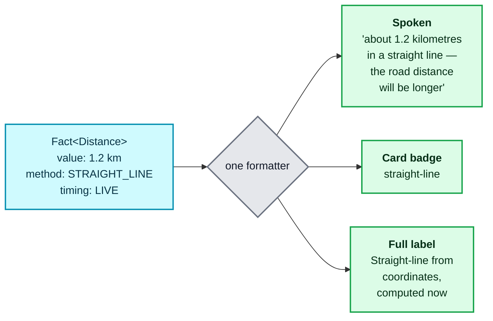

<sub>[⤢ Open this diagram in a canvas](https://mermaid.live/view#pako:eNp1ktFv2jAQxv-Vkyu1L2ElgQJLEdIEZUOK9hAqXpZputjnxKoTI8cpm6r-7zMJRQipect3vt_3-XxvjBtBLGZSmwMv0TpI0qwG_61_ZWyN3N1q97hSjcOa023hHue5vV-8om4phvBLBC9Vp1TkSiNi2D6n3zbffzz_STY_n7qKU5WqixiSze4pY79hMFhA-pYxUxNIYyt0jmzG3nvbtKvvvPk8X2z35oXq-X2-6Eh3mJvW9a5KG29pqekqqgaExllURelAK4_O2mgYjvsEJYE1KECc7tGpB6U15ATa1AXZOx_tMsGyT7BEKyBHUdA5xYfN4Ghz1ZX0XevWozXmpM9d28sukNb0Y-PGWKFqdNQEJ6Hat44E1ObQwXs819g0K5Ig_ZOA9NHjGy4lSgp8Hj-l-GY4-xrm0el3cFDClXG0_xtwo409lkej8fiaVn3A6IGmlJ9hk3wazYafwsIwnEXTK9irosOJJrjkND3TwgmOxvh5tIeIwskFDdbdPS-V9Jj1UtgFyyDpPFnAKvJ7pIRfZL9Y_rkr_zAxZEyQxFY7v13-ELbObP_VnMXOthSwdi_83FcKC4tVL77_B9Bd_28) — zoom, pan and export</sub>

**The rendering rule.** One formatter takes the wrapper and returns *all three* renderings from the *same* object. The grounding test suite checks three views of one truth, not three independent pieces of code that happen to agree today.

`null` lives inside the wrapper too, so "not stated for this listing" travels with its reason instead of degrading into a blank cell or, far worse, a zero. A missing deposit is not a deposit of ₹0.

---

## 5. What is stored

### 5.1 The things the system knows about, and how they connect

The colours group them by **how long each one lives** — which is the single most important thing about them.

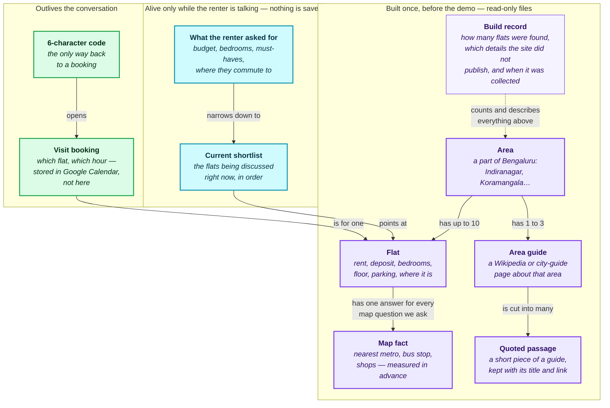

<sub>[⤢ Open this diagram in a canvas](https://mermaid.live/view#pako:eNqNVtty20YM_RUM_Uo1lmU7icajGfmWeuxUbuzED1UfllxQ3BG5y-7FrCbJvxfgUg5lJ034RHFBHOCcA1Cfk9xITKZJUZk2L4X1cH-61ECXC9nKiqaE049XN_d_LZPToCoPRueYQoaFsQi-RJBYG1iGg_3xIVgUcmR0tYFCVeiWyd8xF19SWcy9MvoJga-bxRmlPslmc3r35FU2O8nsq9mJmglouBpTwCnqlaiCDdPu7EpTJqHFStgUro0VteBzwSUcHJ-8UrMd2Mub-X1EuKyEHyJY1D6l8hvjlOeWpDWmdml3TnwYyk81rJVepdCWSP0qD8q9gHg_v72MEO9FA4XId2A0CovOQ43eGoIJDpw3TYRxpWnclr0ahQsWJSgNQj4KYvoF1ruPV-cX3xiDVVASd3l7UGvVoFQCjIVc-c0oBnFAI1YIIjPBk3bCg-hYf4ZxO7-7ixB_BuOpnkY4Ry_uwlDppE-jMEdWqS8ltrXGxkOrfEmMOfDKV4SqJVRKr1_AfbjoLcAGk-Sh3Fg5xCpNCyQymYoUdNCyEoUJWkawtlR5STp6oSrXWZL0JF8qCdr42HbIKuXKtCuCpNSsZCsc5KaqyJUod6pCLZf62RTcXH1i3ueVeqR-2eKEW8URYCehJWuAFxX7Zaso4Zf8k06ceET5CwPxMP-j9-sDCzRIL9yatKC5G3KTBbnCoXuhDs6PSkJzW3owTuqGuq3rQNR480KEu98XH3rcs2AZMQpMtO24meuJMmTInUnl8uAcEcgBVq1KT123KXuYZET7U2KvLy5uCXgRPFMbBcyNfkTrBLPzC5ydLhbXsfZPirSHzBhWYVh3NAlXzrPM96UJttcpjqI3_ey9M2ZFyp6JiuqlLdMdk5TATL5g7myxHcjjEW9QGn8Si9fqc96ia8QGMpGvuwNvaG6eqv0-UbQhYTSafVkmJRk2NKQejPeXyZdutX0vZswhE47otkUM6W77ILJjThtAaYrjweJQHvoYyWkH2Yzm2XU0dew9QBJm0xVf07L7J9BqYzlaZH9yIt6GMRENNox-6xLlNK7kGR4_iS63KkPXJenSxSGhtfSInIG62TbP09DXooW1pnUgTaupQQ7sTBsDu9s-sjGqA_O7JLFLvhHAvVBruyGsZR9iGtSOT_m1bTl5RZvwHAva4vwtpI9cNd1DiW8LTB2t9zVO917nE4Gy_zlqlfTl9KD5N6VVY-x07wDH-8dHz9LFndfnK46KSVH8b77xT_J1Sypmy4tCDKrbf_N2nB38sLr9N5PJ4eGzbGvEps8m8yLH10_Zxsdicih-nO2IqjseZGNpU6Y7ZZeknSdTdl4kdBjJ5om0DJ-yH9KoNfc4PGKd0k5ArjdJkxptLZSkPzeflwnNX01iT2GZSCxEILDkKwWJ4M3dRufJ1NuAaRIaKTyeK0HLqY4Pv_4HY2XxIg) — zoom, pan and export</sub>

| Colour | Lifetime | Why it matters |
|---|---|---|
| 🟪 Purple | **Built before the demo, then never changed** | Nothing here is fetched while a renter waits, so nothing here can be slow or unavailable. One field is shadowed at runtime — availability, by an in-memory overlay (§8.4) — but the files themselves never change |
| 🟦 Cyan | **Exists only during one conversation** | A refresh loses it, a second tab starts a fresh one, and nothing is written to disk |
| 🟩 Green | **Survives the conversation** | And it survives in *Google Calendar*, not in a database of ours — the code is the way back to it |

**How to read the arrows:** an arrow means "leads to" or "is made up of". *An area has up to 10 flats. Each flat has one answer for every map question we ask. An area has one to three guides, and each guide is cut into many short passages.*

### 5.1.1 The same things, in engineering terms

| Plain name | In code | What it holds | The point to remember |
|---|---|---|---|
| **Flat** | `Listing` | The 18 details from spec §3.1, **each one a wrapped fact** (§4) that knows it came from the dataset, plus an id, its area (the specification's `locality` field), and a note of any duplicate merged into it | Two adverts for the same flat are merged when the address matches or the coordinates are within 50 m |
| **Map fact** | `OsmFact` | One row of *{flat, question, answer}* — always from OpenStreetMap, always measured in advance, always stamped with the date | The question comes from a **fixed list**, so every flat has a row for every question — `null` where there was no answer. "No metro nearby" and "we never asked" stay distinguishable |
| **Quoted passage**<br/>*(a RAG chunk)* | `RagChunk` | A short piece of an area guide, with its area, title, link and the date it was fetched. Created by splitting the guides at build time — it sits in the RAG index whether or not any question retrieves it | The area is not a label on the passage — it is the **key the whole index is split by**, which is what stops one area's text being quoted about another (§9.2) |
| **What the renter asked for** | `ConstraintSet` | Firm requirements, softer preferences, the commute point, and a flag per item saying whether it has been read back and confirmed | **Never edited in place.** Every change makes a new one, which is how "you changed only what I asked" can be proved (§8.1) |
| **Current shortlist** | `Shortlist` | The flats being discussed, in a fixed order, in three groups: matched, unknown-on-a-detail, and excluded-with-a-reason | Grouping the cards by area on screen must never reorder it (§8.2) |
| **Visit booking** | `Booking` | The flat, the hour (in IST), the state it is in, both calendar entry ids, and the renter's email | The states it moves through are in §10.1 |
| **6-character code** | `ConfirmationCode` | Nothing but the code itself | It is the only credential in the system. Unknown codes and cancelled codes get **identical** answers, so it cannot be used to discover other people's bookings (§10.2) |
| **Build record** | `DatasetManifest` | Every area with its count of flats and the total, the availability marker found, the list of details the site did not publish, the rule used to trim over-supplied areas, the map question list, **the exact embedding model and version used to build the RAG index**, and the date | This is exactly what sign-off requires published (spec §7.3). Producing it **as an output of the build** rather than writing it by hand afterwards is **[AD-2]** |

### 5.2 What is deliberately not stored

**No listings database. No transcript store. No PDF store. No user table.**

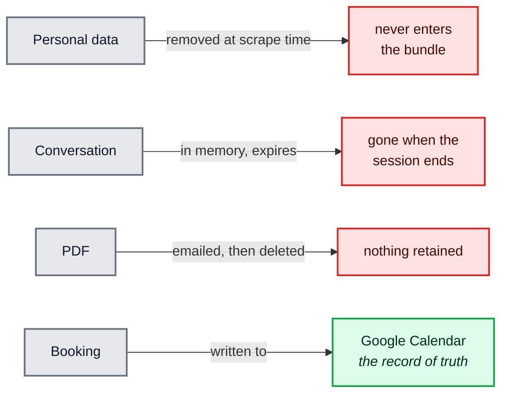

<sub>[⤢ Open this diagram in a canvas](https://mermaid.live/view#pako:eNp10lFv2yAQAOC_ciKvRE1Y41RWFCmxtb3sYdoe5z5c4ByjYIgAN63a_veBEyVdpfoN7u7jDvPKpFPEStYad5Id-gg_fzcW0rf527Bf5IOzaEBhxIY9wnS6fmuYp949kQKMEKTHI0HUPTXsDTYiVVl6Ig9kY6pe7fzdOnYEu8Eqk3Iez_o25VXOpsSAUTt7w7WFPvn-hQM9H7WnkOFthvfOEpw6spDEUQ4UQqpOh6lwtavcef39RlKP2pDiucyCIkORVFarsV0XO2334CmitjlwceoU3Dp3SMGbdfI6xtyBy0CdgR_O7Q1BhSa1gX5sbKXHqT1J5xW4FqIfYre60-uRPx8gDYZQUwvjYK02ppy0RIIED9G7A5UTJUUhistyetIqdqU4PnPpjPPl5H4xwxl-0g50jBdNyVbS8qrNC_x2j19qs4WgefFJC15eMFrQknZXrNgtxcPsS2w-nz-I5QcMNnzLK15n8b9twbeCV2K8hY-BWoyjMM568ukXqvROXxuW7jU_thIapqjFwcSGvackHKL782IlK9NdE2fDMb1aqjXuPfbnzfd_8f72zQ) — zoom, pan and export</sub>

**The absence of storage is a feature, and it should be defended.** Adding a database later would reopen every retention question the specification deliberately closed (spec §2.5, §3.2, §5.3). The one thing that genuinely needs to outlive a session — a confirmed booking — already lives in Google Calendar, and the 6-character code is how a renter reaches it again.

---

## 6. The backend, part by part

It is one process, but it is easier to understand as **three separate paths** that barely touch each other: the conversation path, the booking path, and the support layer underneath both.

### 6.1 The conversation path — follow the numbers

This is what happens between the renter speaking and the renter hearing an answer. **Every turn walks lane A. Only "why?" questions also walk lane B.**


<sub>[⤢ Open this diagram in a canvas](https://mermaid.live/view#pako:eNqNVW1v4jgQ_itW-mFvpfRKeG0R4gQUnQ6Vq0RQq9OyHxxnQqwmNrWdUrS7__3GTkIDu0gb8YXMzDPPPPOSbx6TMXhDL8nknqVUGfKw2giCz_Kf2R9fNt5Uyb0GNYrUzTjnTMldKgVsvK-fyfX1-PvGC8imaLWiAaFFzOXG-06eQ4x7hiiU7AUM2VIDe3rAkBL4Oawi29Z5_YjOo2i8LpQgj4qloI2iRqrRTTR2WUd8rAqhiUmBGOtFRewMO85eytcZFTC64eNjjnC9RthwB8BSYiQx8G5qsHuA3VbR_CRg_UhGJatOXc9eqlhbighWoS4tKGjNpSBLKui2EgZR9yk1JKWaRADCvdSUx0RLklB1IZWCHPIIVJlluRGlgy4i5LdLycPk3_kEUz5geWSCvNqtoEsKEWOIQRV8W7wgLJVSA6l5E3gDdXBSHXPaJ-YKmLHU6xbbZxFggoWMSFBX8reSr5aw--9EsAoqeC24JSwM0v1qW0hmK4ydSWE7xkUp8ArigoGqXcK5lSyVymRclx5zseVugkqM0GHkeWHAmUNQb5zBkTqI-JfCTGthprUw8L7LkIdP9tykqHyhGOgPWT7t08Nfn5wumkiRHX5DnZVltwKjOLzRrFbIpFwTqoA6mKq5rprVvAzQMsMm6DoAN6biQ3agCEOaeTNs0a6a0K4jJsKkuGucHTuxSxXVUM57QlmjC3ZEZhaSTLTGgco-pjJGjDKkEIwbiraTWWyIi2NZTmX3uNAZrq2bTTeIZ2692s1qQBJZ5qxEfi1wjVHMY_S0TuOgKoi-tT4tPwzTXxmeluWFeOKwv17iucrItOAZLkHzRNgaHRNsjtjakp0lKs-X2wmcYQb8DfSJBE_LKumgLijhuF5E46SDsIOIR2pt27rGI2JXQbuzUicOc5plWO2flJ-u-drdOTKfrM7vKALQF7cjny9xYNTuHe44sW07Sjn_b_4TGFN4cUqsEg3HS-t7SEhhK094lg2v4ghoAj5uqnyB4VW71-9AVP293vPYpMP27t1nMpNqeNWKgqhDz9CYVFChsSRporVu74KofYrWaaDddjrd7hla7hpZwiWQdNjgCBffDQat_kVy3V5AW52fyMU1uZglDD7Qgj7tdOnlUnttCPpnaLIwNbUEutA_gkEQxN3by9RYqxfcNcDsV9THCfCxca4dTdtz6K8f_XDplG0a8IPjLwJ_0fbtEDmlmubZyg_n_iz0V_ibh_5s4spvuuBAYQ2e7-WgcvwO4Rf-28bDpchxnodk48WQ0CIzG-8HOtHCyPAgmDc0qgDfK3YxfrPvObWfyfLlj_8BnRCZoA) — zoom, pan and export</sub>

| Colour | Means |
|---|---|
| 🟦 Blue | The renter's browser — the only thing outside the backend |
| 🟦 Cyan | The parts that run the conversation itself |
| 🟨 Amber | **A call to an outside provider.** There are only four, and only two of them are models |
| 🟩 Green | **Plain code. No model, no network.** Every decision about listings lives here |
| 🟥 Pink | The single exit point. Nothing reaches the browser except through it |

**Three things this picture is meant to make obvious:**

1. **The orchestrator is the only part that knows the whole turn.** Everything else does one job and hands the result back. Nothing calls anything on its own initiative.
2. **Lane A is almost entirely green.** The only model in it turns words into requirements; the choosing of listings is ordinary, testable code.
3. **Both lanes end at the same box.** The screen, the spoken answer and the Sources list are built from one object, which is why the commute method cannot say "by route" in speech and "straight-line" on the card (§4).

### 6.2 The booking path — the same code whether it starts by voice or by click

A visit can be booked by saying *"book the second one, Tuesday at four"* — the orchestrator then calls the Booking Service — or, for cancel and reschedule, by entering a code on the confirmation panel. Either way the booking action itself is an **ordinary HTTP call into plain code**, never part of the audio stream. That is why a confirmed booking survives a refresh, and why cancelling needs nothing but the code.

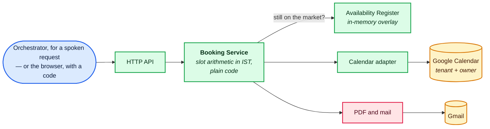

<sub>[⤢ Open this diagram in a canvas](https://mermaid.live/view#pako:eNp1k29v2jAQxr_KybxptSAIf9cIZYKisUqthhrUN81eXJILWDgxc5xS1Pa77xIKY2jkRWTfc_49Z5_9JmKdkPBEqvQ2XqGxcP8Y5sDf5Oo5FD9NvKLCGrTaOJBqAwjFRq8pB0O_S5ZGkWn5Ydlpuz1g2a4IIqO3BXH-VtoVL6gsQvHrGppNH8bzO-b-WCzm1ZDDezce1_IkYHUU-ROt1zJfQkDmRcY0akV-7TSSfqG0BTTMzsjKGGQOd8HCqeWNQp5WhqOW9I_0SVDB30NRWKkU6LyuM0OzJvstFO8wfmLb8QtKhZFU0u7gkZaysGQOrjJvZpRpswP9Qkbh7j8GcDu-Z84tKsoT5LNKcMMIzqrV2fNVKGZaLxXBIeeAt5RjbuEL6G3OpjX7-l_4fPqd4fwHzBMuXqoj-KEm70PVqv26WGFRTCmFkrsBKe_cayQRYUoOt5Sb6DU6_UGXos9pcysTu_I6m1cn1kobr9GO3KiLZ7TqdA-0OI1peKS5A-z28DKt3yF3cEbTpf2EpSn1aHCEkesmva8XYb243XdvzmD0eoRR2o3_VpbcDIftwWVY38V29wQGk_rQTiN8Q51J4HCLnfHT_k6fqFVbeCunoZkze6gqEo7IyHBzEn5nb6Hgq5fxe_AgFAmlWCobig9OwtLqYJfHwrOmJEeUmwQtTSUuDWb74McfCjMvIg) — zoom, pan and export</sub>

No model appears anywhere on this path. Details are in §10.

### 6.3 Underneath both — the support layer

These parts touch everything, which is exactly why they are drawn once here instead of as a web of lines across the diagram above.


<sub>[⤢ Open this diagram in a canvas](https://mermaid.live/view#pako:eNp1kk1v4jAQhv_KyFx2pbAFuiXdCCEhyvbCCbqnugfHnhCrjh3ZDi1q-993YlgWVWpOzjszz3y-MekUsoJVxr3IWvgI6w23QN_y9_0jZ0tnK70DYRWUzkWQNcpnzp5gOJy_c-ax6gIGiA5CpOhZ6a_muiL_Q6y13YEO0OgQ6MnZOyw2j984m5XzhY9YCRkpynmcXZXzFKlEFAEj8G40KnPYLO5BW4WvJyH5tB6la9ouooJGtNBjAmffn45lLzbn0oQaOmsOGRgnFHk7K7Gv4s92RZ1ta-ej0SHCyu60xQRfuqYhMmzR77U8ahuMXuNeGGr7mONhtSbAAxpsyHZI4_iRkjqLEL2QCC16iJ23WWL0emiFTXJfPgk2ppGsexbu0R_-G0CUbo8p3zGjNCKEO6ygNSJCpY0pBniDOZZZiN49YzGYlvnkdnT6Hb5oFeti0r5m0hnni8F4PL6d5J9oafr_cAp_VXjG5fJaoPoSN8HxaHrzCdff0ommZCUxP9PGU3H9U3xJG90Qb3pB668vozFnNJ7U86WNVpwKv9Ropyk9y1iDvhFa0VG_cRZr2hFnBXCm6OI6Q0P_ICfRRbc9WMmK6DvMWNfS7eGdFjsvmqP48ReAZgoO) — zoom, pan and export</sub>

The artefact store is **read-only at runtime**, written only by the offline build (§3).

### 6.4 The full list of parts

| Group | Who is in it | Its one job | Where |
|---|---|---|---|
| **Edge** | WebSocket gateway, HTTP API | The only two doors into the backend | §6.1, §6.2 |
| **The conversation** | Turn Orchestrator, Session Manager | Knows what stage a turn is at, and what this renter has said so far | §7 |
| **Voice and models** | Deepgram, Groq, Smallest.ai, Anthropic clients | Thin wrappers over providers. They hold no rules of their own | §7, §9 |
| **Decisions** | Constraint Reducer, Shortlist Engine, Commute Service, Booking Service, **Availability Register** | Every question that has a right answer, plus the one listing fact that can change at runtime (§8.4) | §8, §10 |
| **Grounded answering** | Retrieval, Resolver Registry, Job 2, Claim Assembler | Fetch facts, phrase them, and throw away anything that cannot be cited | §9 |
| **Presentation** | View-Model Builder, PDF and mail | Turn facts into exactly what the screen and the PDF will show | §11 |
| **Platform** | Artefact store, Calendar adapter, Telemetry, Config and boot check | Hold the things everything else depends on | §6.3, §12.3, §13 |

---

## 7. Listening and understanding

### 7.1 The shape of a turn

One state machine per conversation. It is the only piece of code that knows what stage a turn is at.

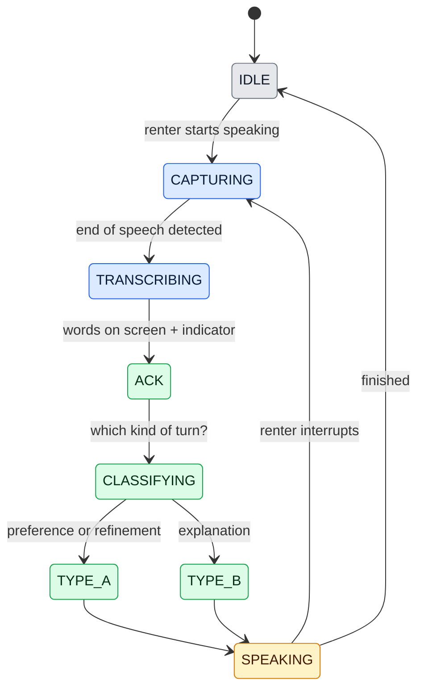

<sub>[⤢ Open this diagram in a canvas](https://mermaid.live/view#pako:eNp9k11vmzAUhv-K5dxtRArQQMfFJvKxKWpVRaG7qMY0GfvQWCE2ss2yqep_n8GB0GwaFwiO3-d8-wVTyQAnWBtiYMXJsyLH6c8gF8g-3959R9PpR7RZ3a-dpf3qTMt0-_h1t3n4kiAFwoBC1oMyGukayIGLZ6cfZB30uEsfsuVus-g4EAzJsgWA7hEDA9QAc9xY2aHp8i5BJ6mYRlIgTRWAQO8RF4xTYqRymFW57O7TLNt8furinPbc-rc5deFMo8Snc3IXlUvvabv-kSaoVlCCrYoCksqWV3IBR1vkf6iFLedXXRFBDJfiXEPnrtNk23V6Z4HRweIfB_3f0PQE2dhc7_u2vBH8PQLevlVTG52fc6AV0XoFJToRbqyzqkomMIcYCk8bJQ-QTKIiDm5nHpWVVMnE9_3bIL6CK66NbbfDWQGkhAEP5lFovZ3xWeEXIbmOLdWhh2lJIR5gPyLhDRngeQB-dAUbUvVwCWVILzD7EMezqIdv5j6ZhSPY7Wpb99g4NM17s2KuwrHQrpI3GrXnpumdZ9eWNFYPg2nTxR4-gjoSzuzFesmx2dv1yXGCcsygJE1lcvxqRaQxMvstKE6MasDDTc0ul9AZX_8AuBsdZw) — zoom, pan and export</sub>

**The acknowledgement is the load-bearing state.** `ACK` fires the moment the final transcript is on screen and the thinking indicator is up — **before any model is called**. That ordering is the only reason the 700 ms budget is reachable at all; the specification says explicitly that no model call may sit inside L1.

**Interrupting works because of one transition.** If the renter speaks while the system is speaking, `SPEAKING` goes straight back to `CAPTURING`, cancelling the audio stream in flight and, if it is still running, the Job 2 call behind it (spec §6.17).

### 7.2 Turning speech into text, then picking a lane

Speech goes to Deepgram over **one WebSocket that stays open** for the whole session — opening a new one per utterance would spend the L1 budget on a handshake. Deepgram is configured to declare end-of-speech within **300 ms** (P3), which is the single largest term inside L1, and it is primed with the name of **every area in the scraped dataset**, generated from the dataset rather than typed by hand (spec §5.1).

**[AD-3] Choosing between Type A and Type B is pattern matching, not a model call.** Explanation-shaped requests — *why*, *what is the area like*, *is the commute realistic* — are matched against the current shortlist context before Job 1 runs. Asking a model which model to call would spend the acknowledgement budget twice, for a decision a short list of patterns gets right.

### 7.3 Remembering the conversation

An in-memory map, entries expiring on a timer, one lock per session. It holds:

| What it holds | Why it must |
|---|---|
| The current `ConstraintSet` | So each new instruction edits the whole picture, not just the last sentence |
| The current shortlist | So refinements can be applied to it |
| **The last order that was read aloud** | *"the second one"* must mean the second one the renter **heard**, not the second in whatever order the system now holds internally (spec §6.30) |
| The clarifying-question counter | The budget is 5 questions, and it is enforced here (spec §2.1) |
| Whether audio playback has been unlocked | Browsers block sound until the user clicks something (§11) |

Two behaviours fall out of this design rather than needing code of their own: **a second tab is a second conversation** (spec §6.22), and **a refresh loses the conversation** (spec §6.21). A confirmed booking survives either, because it lives in the calendar and is reachable by its code.

### 7.4 A Type A turn, step by step

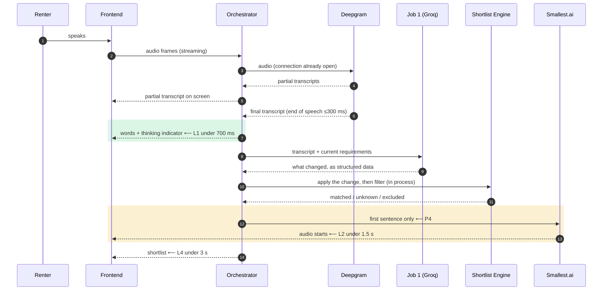

<sub>[⤢ Open this diagram in a canvas](https://mermaid.live/view#pako:eNptVE1v4jAQ_SujnKiasgRoKTn0xIeEVmK14ZiLsQdikYyD7YhFVf_7TkLCspScJp43kzdvnvMZSKMwiAOHxwpJ4kyLvRVFSsCPqLyhqtiivbyXwnotdSnIwwaEg99I_lFyMa-zC2s4TepB8brOr63M0HkrvHnQY7asMTPE8h-h2_wqqvMrs4UIektrjk_fMUnDI8mM9bl2Hua014QP-GySBliIPGdGfaFTuqA2Lx8fi3kMrkRxcJezxZwPN-uY9VHawI7poYMeT4Ki0LRviWzWDJstO1hPGiKUXhsCkTNUncGUSC16tnxpuzbERA4sDDlpdendtWHL5jsEuCtHiHTfbqfpf2SPVwJmV4-EMoO0Gg7fxqPBAArXcrFME-x-K3qjcQjRdBLClINBP3p7uqdyMlY5eAafaTrw8KBJaVmvtO482b3CzwgqUmhh0nzj0uBqi0alVRTfMnwGWVnL3mImx0pbLDhuC1dRN9gpEx5kJmiPKqzXxwuopK8sKlDCi5v-CRMVZZmfmSa2NWEdE8uTs4WhpwlKayS6ToRk3n2oEJ6NquAHz3EgcyKO8I_MK4XqXrBho9hkGsJ7I9j7rRnYZvU-LDvR1TeH7xvvjVm1Sv0at-BN0sl78Y7zvHB3FXTYChr1X-GBnp1lr7bv6sZt3QhcEAYF2kJoxZf_Mw1YiwLTIIY0ULgTVe7T4ItB9S8gOZMMYhYXw6AqWdruL3E5_PoLw-Bcig) — zoom, pan and export</sub>

Note what is **not** in this picture: no network call to a listing site, no map lookup, no second model. A Type A turn touches three providers — speech in, the fast model, speech out — and otherwise runs on data already in memory.

---

## 8. Choosing the listings

This whole section is plain code. No model participates in any decision here.

### 8.1 Applying what the renter just said

`(current requirements, one edit) → new requirements`

The fast model's job was only to say *what changed*. Applying that change is a function, and it changes **one field at a time**, leaving everything else exactly as it was. Changes accumulate: "under 40k", then "actually 35k", then "and a lift" is one set of requirements, not three separate searches (spec §2.2).

Requirements are **never modified in place** — each edit produces a new set. That immutability is what makes the edit-correctness suite meaningful: it can compare the before and after directly.

If a new limit contradicts an existing one, the reducer returns **a question, not a new set** (spec §6.5). Contradictions surface as something to ask about, never as a silently broken filter.

### 8.2 Filtering — three groups, not one list

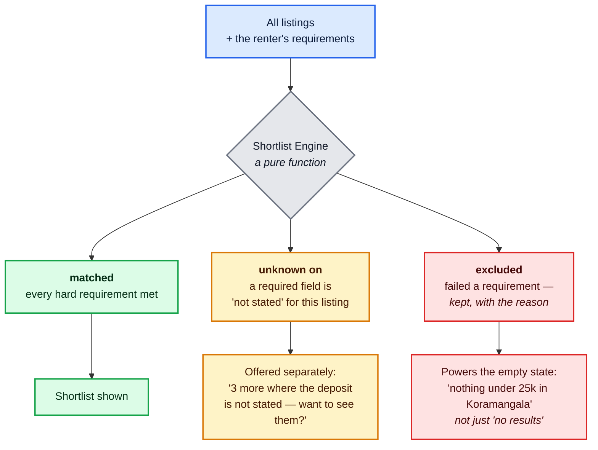

<sub>[⤢ Open this diagram in a canvas](https://mermaid.live/view#pako:eNp9lF1vmzAUhv-K5VzkYlQF0iQdijJtajVNU9dJWaVKZRcGHwcvxma2GY2q_vcdIKQ0U5crMJzn_cDxE80NB5pQoUyTF8x68uNTqgn-vnx7SOlHpYiSzku9davMnq_fEV8AsaA92KnDi9-1tFDivUvpT3J2tibX3z4_pXRTGOvbUXKtt1JDN72Sa0aq2gIRtc69NHp1Ltcpfe4lcbIj3KDyKluXzOcF8NV5tu6m4Q_YPUGTfKxLSvAo_Zpw1xNqvdOm0aTVOUDYMMuJkKA4kX2wqTaeOM888CkRxmJO6Ybs__Dvez485qrmI4uCSYVk9spgWsdhdDEUsIPKB6SRvjhUydxQA4r0MjedyOZhXKMrMMnRyF33xi2-cSsEtGkcVMyifbVP-kAzUhpsuinwcSfFoTJO-u4pZnsJfHBIGoZuvUFUN1B-mB717vtPi3rfTQPWdUAoK7_vGcmxxAL7IrXmYEk83xGpyVdjWcn0lik2HVpoxX_VGAtHsANXK--mJy3kijl3BaJlCKlUMuEZMAGB89bsIJnE88UMssPtWSO5L5K4egxyo4xNJmEWZTN2wgJ018NgDsvjdDJZZMv4MnwTFkXRZbw8gW2N4YO1XOSwPNKiBZtdsLetzWOIFie0htkhqAAxy19o_P1yGS7epF3MIxbOTmgZ40cYxBC_wPJ4Ef8PFrJw3BqeBPgFxgvtvwB7HC_dBJuujfHaXXDbZRqv3QfXrTMa0BJsySTHswdPi3a3QUoTklIOguFuwEMBX2K1N5u9zmnibQ0BrSuOm-1Ksi1uqX7x-S9l-I7w) — zoom, pan and export</sub>

**Why three groups.** A listing whose deposit is simply not published has not failed the renter's budget test — but it has not passed it either. Dropping it silently would turn every sparsely-filled field into an invisible filter, quietly making results worse the more fields the schema has. So unknowns become their own group the renter can opt into (spec §3.1).

**Why rejects are kept.** Holding on to the *reason* each listing failed is what lets the empty state name the requirement that is actually binding, and suggest a relaxation. The system never relaxes anything by itself.

**Ranking is stable, and separate from grouping.** The cards are grouped by area on screen, but that grouping is presentation only — it must not reorder the shortlist. That separation is what lets the edit suite demand that untouched listings come back byte-identical, in the same order.

### 8.3 Distances and commute times

Two paths, and they are never mixed up, because the answer is a wrapped fact (§4) that must name its method.

| The question | How it is answered | What the wrapper says |
|---|---|---|
| "How far is the metro from this flat?" | Read the precomputed OpenStreetMap fact. **No network call.** | `source: OSM`, `method: ROUTED` (or `STRAIGHT_LINE` where routing failed at build time), `timing: PRECOMPUTED`, with the index date |
| "How far is it from my office in Whitefield?" | The destination is not known until the renter says it, so: **straight-line arithmetic over stored coordinates** — local maths, no network call | `source: COMPUTED`, `method: STRAIGHT_LINE`, `timing: LIVE` |

Real routing for the second case is an opt-in path, taken only if the latency budget proves it affordable.

**The service cannot return a distance without a method.** That is not a code review rule; it is the wrapper's shape. And every straight-line answer carries its caveat **in the same breath** — a straight-line figure heard as a travel time understates a Bengaluru commute badly enough to change someone's decision.

### 8.4 Availability — the one listing fact that can change after the build

Everything else in the dataset is frozen at build time. **Availability is not**: a flat can be taken off the market between the scrape and the demo, or between being offered and being confirmed. It is therefore the only listing field with a runtime owner.

| Where it acts | What happens |
|---|---|
| **Filtering** (§8.2) | An unavailable flat is `excluded`, with "no longer available" as its reason — so the empty state can say *why*, and it never silently vanishes |
| **Admin toggle** | A small endpoint flips the flag for one flat, guarded by an operator token that lives with the other secrets (§13.5). This is how the demo shows the behaviour without waiting for the market |
| **Re-check at confirm time** | Before either calendar entry is written, the flag is read again. If it flipped, **the booking does not happen**: the flat is dropped from the shortlist, the renter is told plainly, and the remaining shortlist is re-read to them |

**This is a different re-check from the calendar one (§10.2).** Free/busy asks *"is the owner free at 4pm?"*; this asks *"is this flat still on the market at all?"* Both run at confirm time, both can send the renter back, and confusing them is how a demo ends up booking a visit to a flat that no longer exists.

**[AD-11] The flag lives in an in-memory overlay, not in the artefact bundle.** The bundle is read-only at runtime (§5.2) and there is no database (AD-7), so the toggle writes to a small in-process map that shadows the dataset's value, and it dies with the process — a restart returns every flat to the state the scrape found. That is honest demo scope: it keeps "no database" true, and the only thing lost on restart is a demonstration toggle, never a booking.

---

## 9. Explaining, with sources

This is where the zero-invented-facts requirement is either won or lost. Four components, in order.

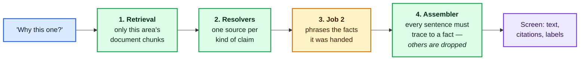

<sub>[⤢ Open this diagram in a canvas](https://mermaid.live/view#pako:eNp1k01v4jAQhv_KyBy4hK-EDzVCrFDbC9oeClJ72OxhYk82Fk6c2k4pqvrf1ySURkjkNjOe531n7HwyrgWxmGVKH3iOxsHvbVKC_57_JKz_mh_B5dKCLulXP2F_YTBYwXbna8t0NRnClpyR9I5qOUpXy9SMVrpU5x40hH3bJIXmdUGlA57X5d56UCuy3bXAxzMxPBGtVu9kbIdIYHVtOEFFpkntZSlAZ8AVyuKH9tjiNmFLi4aw0SmEF1KVG7RkvT2CDLlrzUkHB7SQYylIXGCbsGHdr1vWdAhra6lIlbfwzSPv8wjWD0ald1fU1jV5Z9CHTgM2MpDU4XgybUpLudJe3jTrAWF0VZFYjuTqIny_boRfnrzwjhuiMgZHHy5o-rl06KQubQAKU1LtLttOvw1rHyiDN8ikUnFPpIQZBdYZvae4F87mEaXncHCQwuVxWH0EXCtt4t44naQRXqGso-qbxjNOiwttMsdoirdps5Am8yta4V-bOuMyyiL-gxN3i8V4fhM3nU1wHF3hdO3OMBJ015l0wSMkcRPmnY3nsw4MnuGtG253gX9Mgb-K0_zdin8WzRDd3MvTyQkLWEGmQCn8__SZMH_LBSUshoQJyrBWLmFf_hDWTu-OJWexMzUFrK4EOnqQ-M9g0Sa__gPfQilk) — zoom, pan and export</sub>

### 9.1 The RAG pipeline, end to end

The four boxes above are only the live half. The full pipeline has **two halves that run days apart**, and it is worth seeing them in one picture — the build half decides what the system is *able* to say, and the question half decides what it *does* say.

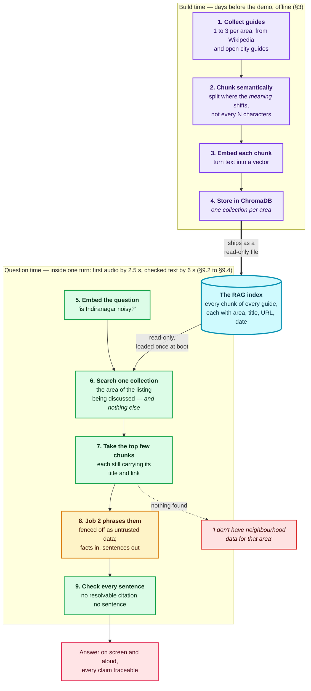

<sub>[⤢ Open this diagram in a canvas](https://mermaid.live/view#pako:eNqNVl1v2zgQ_CsL9SEtoDjWh-3Yl_qQXK5GD4e2blPcQ90HSlxZhGXSJak4Rtv_fktRlj-KHE4IIJmiZoazs2S-B7niGEyColLbvGTawsPdQgJdps6Wmm1KeP_mzZdFcFeLioMVa4RFHfejFDjbGciwUBrBlggc1yoEVRSVkAjwclH3-2yUvFoEXz2iu7jQmFuhZMfjrllEDDfZNOrBH6qqaAYsa8HR3Fxl05tMX00jsAoS2KAGppGFUGi1hn_ESmyQC9bMYZKD2qCEXNhdC3BCPos9TUw0ZS1XYHDNpBU5q6pdR2U2lbCwLbFd142YrpFJIZc3V2IKphSFNWEzVSoL-Ih6B-_Aucdyi_qMM_GcSQ_-XGfIAVle0mSi7xhtrSVYfLIgJC2TwSM5oPQpTupx0h58ss5yIWkRZAK7v-uASKoi73PvoXN5b5iTfooXweXllCzxt8TfUj8BJV9I_zhL4fXr6Y9FQOveGGD011ARJr9UstpBISpcBD_g_u7Ly0biA5n28XZGCjk-ddq8T83CKSStbU2RvJeNL1thy7bAVtgKQ_j88e-QomaJ4tXXvahDNt-RK_MaTbPY43QKaQganB3O3gnJ1MYCq7lQkO0g7g3AhKQH8xVVpXGfhodguuiOe7FL3f5H-n-SPG-TPNiX2yXoWyuw8-JCGHgrCYFJtmQapBJm9_vFCf68DeuQCo5MkzmnpT2khxicZc5V91wJIqOwuncZ0hNJNXltDKlpzaGcuGah-JbuPVYGfwnIvA3uqAcPbOVbwaoNFLj1VTw0Z1M6Iq0qyJnWO4cprPHqXBnBsdG2sDplaCN93YO_VAYxbErNDBpHte7AC5Q5Kad9xYWvllbXxtIAZYL95mdQ2xkqeEj9LK2bbkDV9pRr4LnGrvWp5G3-9h90bFKBRqOqR5aRbNpImPN63-3d_FNs30pz30pz30rz1N8Gv3TU_Z17Qx3VtZCHrxTjbqEED4zCqJR1bTWP_WfzQQP4_vMDreRWmi11NoXP5Bppy3MGs0rVPDxutoqJNVjaltAtpxPtJPYaCfsEFKomgcQ2u_3gjBLTi7fAlbywULJHBIliWWaq1qVSvGFw9tNnmopFYl3-LroIeRZiN-YeC8iao4O2iWryAjmOCwyN1WqFkxejPGHI25-XW8FtOYk3TyHFXOnJixij_nBwBmea7c_D5UXBjuD61-Moi0_hkgNc_zpJ0vQMrhKPezSeFzmOOrRoyJKUPSuuPyB5wzO0NR2nVQtXYJHkBzg-Ho36w2fh0kHE-skZHMV4D1ZgisMODKOIp9fPg-X9QTQ-A1uyTacMY4wPyvJ4GP-Xsj7rsyMwOjzCWRzOkpBOh6a6xy8p302JjsfmUTiPw3kSUoqd4SfvUu_a8RilvGnhY87bD24FQRisUa-Z4PRfy_dF4PYKSvYEFgHHgtUVNc1PmsRqqz7tZB5MaMPAMKg37hC5F4wOjrUf_PkvgQDaLQ) — zoom, pan and export</sub>

**Reading it in one line:** guides are cut into chunks and stored once; a question is turned into the same kind of vector, matched against **only its own area's chunks**, and the few that come back are the *only* material the model is allowed to speak from.

#### The three choices that shape this pipeline

**Semantic chunking, not fixed-size.** A guide is split where the **meaning changes** — paragraph and topic boundaries measured by how much the text drifts — rather than every N characters. Fixed-size splitting is simpler, but it cuts sentences in half and mixes two topics into one chunk. That matters more here than in a typical RAG system, because a chunk is not just retrieval material: **it is what gets cited**. A chunk that begins mid-sentence or straddles two subjects produces a citation that does not properly support the claim attached to it, which is an automatic failure at sign-off. Semantic chunks stay readable on their own, which is the same property a citation needs.

**ChromaDB, embedded in the backend process.** Chroma runs as a library inside the Python process, loading a persisted directory at start-up — no server, no network hop, nothing else to deploy. That is exactly what **[AD-4]** requires: for a corpus of a few dozen documents, a hosted vector database would put a network round trip inside the 2.5 s first-audio budget and add an outage the demo does not need.

**[AD-10] Dense embeddings — a small English sentence model — not sparse, hybrid or anything heavier.** Retrieval matches on *meaning*, using vectors produced by a compact English model that runs in-process. Two things decide this:

- **Semantic chunking already requires an embedding model.** Splitting a guide where the meaning shifts means embedding adjacent passages and watching the similarity drop. A dense model therefore exists in the build pipeline whichever retrieval method is chosen — so dense retrieval costs **no extra machinery**, and the same model that cut the chunks also embeds the question.
- **Spoken questions share almost no words with guide text.** A renter asks *"is it noisy?"*; the guide says *"a residential locality known for its pubs and nightlife"*. There is no token overlap at all. Keyword matching scores that pair near zero; a dense model scores it high. Transcribed speech is the case sparse retrieval handles worst.

The usual objection to dense retrieval — that it is compute-heavy — is an argument about web-scale corpora. Here, build-time embedding covers a few hundred chunks, and at question time the system embeds **one short sentence** against a collection of perhaps 10 to 40 chunks. A small model on CPU does that in tens of milliseconds, well inside the 2.5 s first-audio budget.

**Why not the alternatives:**

| Rejected | Because |
|---|---|
| Sparse (BM25) | Its one strength is exact proper nouns — and the area name is handled by the partition, so it never needs matching |
| Hybrid | A second index and fusion weights, to reorder about twenty chunks. Held as the escalation below, not built now |
| Domain-adapted | Needs in-domain training data. The scrape has not happened yet (§16) |
| Multilingual · Cross-modal | English only is explicit MVP scope; the corpus is text |
| Hierarchical · Fusion-based | Built for long documents and large heterogeneous corpora. This is neither |

**The one thing that would change this:** grounding-suite failures on exact-token questions — a society name, a mall, a road that appears verbatim in a guide but that a dense model blurs. If Suite C shows that pattern, add keyword matching alongside and fuse the two rankings, i.e. graduate to **hybrid**. That is a contained change: collections stay per-area, the partitioning guarantee is untouched, and only the ranking step moves. It is deliberately left as a trigger rather than built up front.

**[AD-9] One Chroma collection per area, not one collection with an area filter.** Chroma would happily hold every chunk in a single collection and accept `where={"area": "Indiranagar"}` on each query. This design refuses that. A filter is an argument that can be forgotten, mistyped, or applied after a broader search has already happened; **a separate collection per area means the other areas' text is not in the set that was searched at all.** Cross-area contamination stops being a bug that testing might catch and becomes a thing the code cannot express — which is what §9.2 means by *partitioned, not filtered*, and what the two contamination probes in the grounding suite actually test.

#### What is settled, and what is not

| Stage | Decision | Status |
|---|---|---|
| Chunking | **Semantic** — split on meaning, not character count | Decided |
| Vector store | **ChromaDB**, embedded (in-process, persisted to a file) | Decided |
| Partitioning | **One collection per area** | Decided — [AD-9] |
| Embedding strategy | **Dense**, a small English sentence model running in-process | Decided — [AD-10] |
| Which model, exactly | A compact English model — `e5-small-v2`, `gte-small` and `all-MiniLM-L6-v2` are all reasonable — **pinned to an exact version** and used identically on both halves. Vectors from two different models make the search meaningless. Confirm what the pinned Chroma version defaults to and set it explicitly, rather than inheriting a default that can move | **Open** — pick during §3, pin it in the manifest |
| Chunk boundaries and how many chunks a question retrieves | Tuned against the grounding suite | **Open** — the suite is the judge, so these are set when it exists (§14) |

**One thing this table does *not* affect:** cross-area leakage. That is prevented by searching a single collection (**[AD-9]**), not by how well any model ranks — so the embedding choices above can be judged purely on answer quality.

---

### 9.2 RAG retrieval — partitioned, not filtered

Step 6 of the pipeline above, and the step that carries the grounding guarantee. Retrieval creates nothing and fetches nothing — it **selects a handful of the chunks already sitting in the index**.

A question about a listing in Indiranagar can **only ever see Indiranagar's chunks**. The area is the key the index is partitioned by, not a filter applied to results afterwards.

Why a partition and not a filter is argued under **[AD-9]** above; the short version is that the other areas' text is **not in the set that was searched**, so contamination is something the code cannot express rather than something a test might catch.

**[AD-4] The RAG index runs inside the backend process.** The corpus is a few dozen documents. An in-memory index loaded at start-up beats a hosted vector database on latency, on operational surface, and on the 2.5 s budget it would otherwise sit inside.

### 9.3 The resolver registry — the source rules, written as code


<sub>[⤢ Open this diagram in a canvas](https://mermaid.live/view#pako:eNp1k0-PmzAQxb-K5RzSSo42GDbdoihSFS6Vtn9E2tOyh8EMwQrYyDbZRqv97jUhiWi24QTMm9-bZ41fqdAF0piWtX4RFRhHHtNMEf-sg6eMPkrrpNqSEoRb5uZutZQrg8ox4hu0YaQFs_OC5Z1cZfSZzGYrkvaNCTiw6IhBq-s9mnMxCZ4-ZHQjDLRYkGJQZfTj88mU-94vDSrpDkQb4gwoK90F3Zd_bL69x_Ie-9Og0E3bOSyOwzbQHie3I4PQE76j3Fa57kyl9aDso3sh-kQWSnSHi2OvT7To_Ez_SRP2tr8qaQkYhKk9wTq1s0Sr-jAyjvpk6uCq_jyxtnix6Cu_FexB1pDX-N6lFyQoau9h46PF9CsptJo6UsEeiavATb06U4OXV1qbYNm_yIaUsq7jSZGjT8asM3qH8YTfL0LMT5-zF1m4KubtHyZ0rU08medBHsIVztufYaIU-OkCCxYQRnAbds8xWFzBrNMGTzhRluPZ5g-fg5zfxj2EYRRd4ZRWZ1qJyJFfaIXgC764SYvu5zAfJ_Wbz9acrUO2joYTHBfTgKWcpSFLo_48xqUkYAlnSThE-6cSHeejjDZoGpCFv3GvGXUVNn4NYpLRAkvoar_ob14EndObgxI0dqZDRrvWXxRMJGwNNMPPt79CdzQB) — zoom, pan and export</sub>

**Job 2 can reach no data except through a resolver**, and every resolver returns a wrapped fact. The grounding boundary is therefore a **dependency rule the code enforces**, not a sentence in a prompt that a model may or may not honour.

A resolver that would have to invent something returns `null` with `source: NONE`, and the assembler renders that as an open gap — *"I don't have safety data for this area"* — which is a correct answer, not a failure.

### 9.4 The assembler — the last gate

Job 2 does not return prose. It returns a list of `{sentence, which facts it used}`.

The assembler then binds each reference back to the wrapped fact that produced it, and **discards any sentence whose reference does not resolve**. An unciteable sentence never reaches the renter. This single rule is also the reason prompt injection has nowhere to go (§13.4): text smuggled into a listing description or a document chunk cannot produce a citation, so whatever it says is dropped before anyone hears it.

The View-Model Builder then draws the card, the neighbourhood panel and the Sources entries **from those same objects**. That is why "all three layers name the same method" is guaranteed by construction rather than tested and hoped for.

### 9.5 A Type B turn, step by step

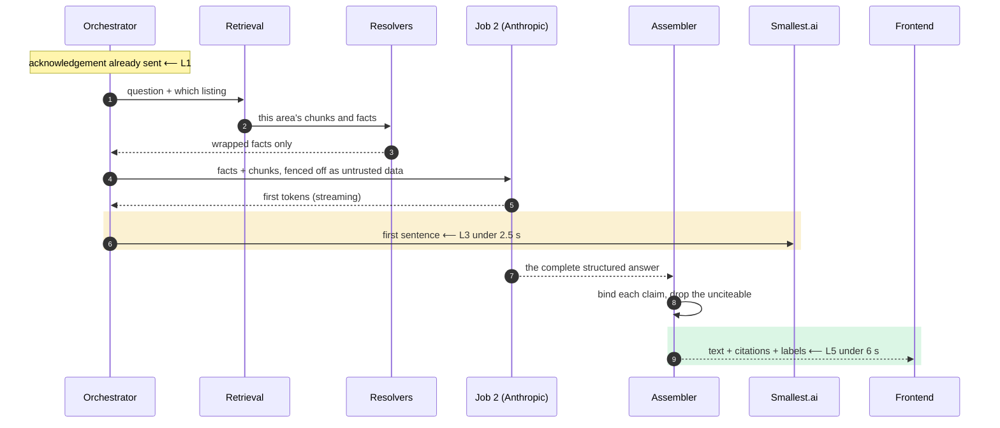

<sub>[⤢ Open this diagram in a canvas](https://mermaid.live/view#pako:eNptk0Fv4jAQhf_KKJcFNUVLWkrJoRJi4YBWiwQccxmcCbFw7KztlEVV__uOSWDRltwm_vz85o39EQmTU5RGjn43pAX9kLi3WGUa-MPGG91UO7JtXaP1UsgatYftCtDByoqSnLfozR1mvQnMmryV9I7qDjDvCGfUO1n3lVgmAViaHSTQm2pfWlNL0f8KzqYBnDpH1U7dNbw9n7WpUCm2PED5lVnMA7KwRnvSeaZb4pfxBIb9cdMpoDhoc1SU76ki3oPKEuYncKHImmRcjODnsN25XT2-va03KXC4zkuj4QGOpRQlKMm13rfYehOwOXO-lA6QBb85EGWjD1zpHAoUvguHsUemg5OjxbqmbhWMVqebU5dJ2i08dEoxFGHCOZiiCG022tvGef6Ro8d26zK5iBfSOg_eHEg76PGICSs23CVvSXiw-x32kqfnGIbjSQyvMXwfDF_7NyY484tSiCccf43oiQ3knGkyGEHX2znzfzZm0xAIgTBVrYhnwC4a4RvLllG742XKs2kH7yRnRcjxCoWyiiHn23KWaLSQnpBvxv_-z_Yn4xgmz2f_L_2rKKsu5myB_vgQovQYRhgCVbgj5a6tjLpWXm4aieKoIluhzPl1fWQRu6goi1LIopwKbJTPok-GwhvbnLSIUm6O4qipeRqXZ9j-_PwLCJos0A) — zoom, pan and export</sub>

**Two clocks, deliberately.** Speech starts on Job 2's *first sentence* while the assembler is still working on the rest. L3 measures when sound starts; L5 measures when the fully checked text and its citations are on screen. They are different budgets because they are different promises.

---

## 10. Booking, cancelling, rescheduling

### 10.1 The states a booking moves through

Four states, and the main line runs straight through the middle: **offered → confirming → booked → done.**

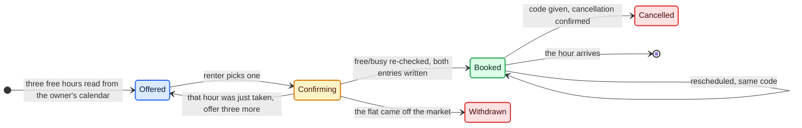

<sub>[⤢ Open this diagram in a canvas](https://mermaid.live/view#pako:eNp9U8FunDAQ_RXLe6hUsSoLWVbl0EOTY6VK7aGH0sNgjxd3wV6NTWgU5d9rA1noJikHJM_Me35vZvzIhZXIS-48eLzTcCTotvdZZVj4pCYUXlvDvnybIj_f_2Lb7Sf2VSkklCXzDSEyFX-N7ckxQpDhbLuQQmYHg_TOMQEtGgk0sczokenWGqWp0-ZYBqzxSOysxckxa3CqXipGwGdrT_HmeOeHuncPAbYVDYoQTVhtfcMCDWl0bCDtPZpXaVYOwI_a2QCO_e6dZx5OaBJmY8nssLP0upwf2jeSYDDlaFi1gU1AhxE9RjqgE_oJO2n_xwahC-Jl30b1LgLjRF6U34IR2LYREfPsqO-jRDGFYRySmJShfIEOY5vkjT6BKKBdNTdGtODcHarZr9JtW25kjaAwcZ4CSbnJ9kWO9XzcDlr6pszOfxJhW0vlJq13dQ5XdJ2WM5lClYvDhUx-PBzS4k2ym_0O0vyKTIZ1eJYmlMCFbVdAfgNvS9tnuCuu2GpYpGGG2SJNZEX2P2kppGufl1Uee7dOrNYkNGKdmeciLws-A54nnFxWKurkCe-QOtAyvNLHiocpdljxklVcooK-9RV_CkXQe_v9wQheeuox4f1ZLi96Cj79BcXjUYI) — zoom, pan and export</sub>

| State | What it means | What can happen next |
|---|---|---|
| 🟦 **Offered** | Three free hours have been read from the owner's calendar and read out to the renter | They pick one |
| 🟨 **Confirming** | They have picked, and the system is **re-reading free/busy before writing anything** | Both entries written → **Booked** · someone else took that hour first → back to **Offered** with three fresh ones · the flat came off the market → **Withdrawn** |
| 🟩 **Booked** | The visit exists in both calendars and the renter has the 6-character code. **If only one of the two entries landed, it still counts as booked** — the missing one is retried in the background, and the renter is never asked to wait for it | Reschedule (the code stays the same) · cancel · the hour arrives and it closes quietly |
| 🟥 **Withdrawn** | The flat came off the market before the entries were written (§8.4). Nothing is booked | The renter is told, the flat leaves the shortlist, and what remains is read out again |
| 🟥 **Cancelled** | Both calendar entries are removed. The code still resolves — it answers "cancelled" | Nothing. A new visit is a new booking with a new code |

Slots come from the owner calendar's free/busy: the **next 7 days, 10:00 to 18:00 IST, one hour each**, with the first three offered. Cancelling and rescheduling are both refused once the hour has started, and both may happen more than once before then.

**Why "reconciling" is a note and not a state.** From the renter's point of view a confirmed booking is made the moment they confirm — that is what §10.2 means by their intended state being authoritative. A calendar write that did not land is repair work happening behind the scenes, not a different state for the booking to sit in.

### 10.2 The four mechanisms that carry the correctness

| Mechanism | What it prevents |
|---|---|
| **Free/busy is re-read at the moment of confirmation**, never trusted from when the slot was offered | Two renters racing for the same slot. The one who loses is simply re-offered, and neither is ever told a booking exists that does not (spec §6.41, §6.42) |
| **Both calendar entries are written at the same time**, with anything that failed queued for retry (P6) | A half-booked visit. The **renter's intended state is authoritative** from the moment they confirm; the system reconciles the calendar behind the scenes. Rescheduling is four calls, and without parallelism L7 would be Google's latency multiplied by four |
| **Every date calculation names `Asia/Kolkata` explicitly** | The backend deliberately runs outside India, so **any use of the server's local clock is a live bug** (spec §6.47). A lint rule banning naive timestamps is worth the five minutes it takes to add |
| **Unknown codes and cancelled codes get identical answers**, and lookups are rate-limited | Someone guessing codes to enumerate other people's bookings. The code is the only credential there is — the specification is explicit that this is a demo-scope limitation, not a solution (spec §6.45) |

### 10.3 The confirmation itself

On confirmation, a PDF is generated, emailed to the renter through Gmail, and then **discarded** — nothing is retained. The owner's contact on it is the labelled placeholder `999999999`, deliberately invalid so nobody dials a real number.

Two rules worth stating plainly:

- **The email address is read back character by character before sending.** It is the highest-error input in the whole system, and a wrong address fails silently otherwise.
- **The code is authoritative, not the PDF.** If the email never arrives, the booking still exists and the code still works.

---

## 11. What the renter sees

```
app/
├── audio/          microphone capture · playback · interruption · unlocking sound
├── transport/      WebSocket client (reconnect, backoff) · HTTP client · contract check
├── viewmodels/     types from the shared contract package — nothing is worked out here
├── components/     cards · neighbourhood panel · sources · mic · booking · failure states
└── state/          session store (temporary, mirrors the backend)
```

**[AD-5] The frontend works nothing out for itself.** It receives finished view-models and draws them. No distance formatting, no method labels, no substituting "not stated" for a blank — all of that arrives already decided from the backend.

This is what makes the grounding suite's assertions on view-models sufficient without screenshot testing. If the assertion passes on the view-model, the only remaining way to get it wrong is a rendering bug in a component that contains no logic to be wrong about.

**What the cards must show** (spec §4): the area name (the specification's `locality`) as the primary label with the society name beneath it, then rent, **deposit and maintenance** (the real cost, visible up front), size, floor, parking, furnishing, amenities. Unstated fields read *"not stated"* — never blank, never zero. **A commute row's method badge is never dropped for space**: if the card is tight, the number comes off, not the label.

**Three audio behaviours the specification's failure list demands:**

| Behaviour | Why |
|---|---|
| Sound is unlocked by the renter's own click on the microphone control | Browsers block autoplay; without this, the first answer plays to nobody (spec §6.15) |
| The microphone keeps capturing **while** the system is speaking | Otherwise interrupting is undetectable (spec §6.17) |
| Switching browser tabs pauses capture, but is **not** treated as "finished speaking" | A backgrounded tab must not submit half a sentence (spec §6.16) |

### 11.1 What crosses the wire

The two hosts deploy independently (§13.2), so the messages between them are a **versioned contract**, not an implementation detail. There are deliberately few of them.

| Channel | Message | Direction | Carries |
|---|---|---|---|
| WebSocket | `hello` | browser → backend | The contract version the frontend was built against. A mismatch closes the socket with a clear message rather than failing later |
| WebSocket | `audio` | browser → backend | Microphone frames, streamed continuously — including while the system is speaking, so interruption is detectable |
| WebSocket | `transcript` | backend → browser | Partial words as they arrive, then the final line |
| WebSocket | `ack` | backend → browser | The L1 moment: final words plus the thinking indicator. Sent **before any model is called** |
| WebSocket | `audio_out` | backend → browser | Synthesised speech, chunked, starting on the first sentence |
| WebSocket | `outcome` | backend → browser | Exactly one of the five shapes in §12.1. When it is `Answered`, it carries the finished view-model — cards, badges, labels, Sources — and the frontend draws it without deriving anything |
| HTTP | `POST /bookings` · `POST /bookings/{code}/cancel` · `POST /bookings/{code}/reschedule` | browser or orchestrator → backend | The three booking actions (§10). The code is the only credential |
| HTTP | `GET /health` · `GET /contract` | platform → backend | Railway's health check; the contract version, for the deploy-order rule in §13.2 |
| HTTP | `POST /admin/availability` | operator → backend | The availability toggle (§8.4), guarded by the operator token |

Everything the renter can see arrives in `outcome`. That is the same structure the grounding suite asserts on (§14), which is what principle **A7** (§17) means.

---

## 12. When something goes wrong

### 12.1 Five outcomes, and the compiler enforces all five

Every turn ends in exactly one of these. They are five distinct shapes, not five values of a status field.

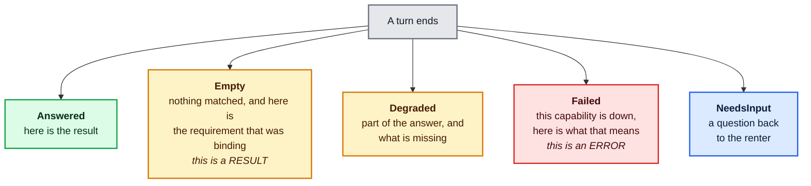

<sub>[⤢ Open this diagram in a canvas](https://mermaid.live/view#pako:eNp9k1FvmzAQx7-K5bwSBUgDHYoiZUoiTZoyKW2flj0c9lGsgKG2EYuqfvcZE1HG2iFefNz97v-_w6-UVRxpQrOialkOypDHr2dJ7PP480y3xDRKEpRcn-kvMp9vyNaG1-lmK3WLCvl6kW7WqVpscnsiQhOTI1Gom8LYihvJFe77wn1Zm-tQJSuTC_lMSjAsR-4RkJzcUC6hx700QmGJ0lg8GNKCJqmQ3Fa6pLWweba3fYGc9g9P3x_XC7GZCNj1Anb4rICPlNed6ypzysHZcjLct7ZrZ7Gl0Np2mxAPPfEAohjxnBQGNaSiEObalfOqld5fY3JgZ6ZE2_QfG5LsT6cfpw9sHPumR0Suv8m6MUNjIC8NaiMqSVJgl15MdduINKgcqWexArTeYWYzNZJMFEUywxXGmHraqOqCySxK4_Devx3nreAmT8L6t8eqolLJLAiC-zCe0KrLjcVZxjAeWEEEyzv4lOWvQgyiCasF--v1tAyzJXun8S9x7Eef0u5WAfjLCQ2VGmAYYvgOY2EU_g_mgw8TGOjBZ4qQ4QALV9FyGOEHPtMgXY5hdqfdAsaRrR3i-Lz3dm4U49ihszMOHDtJ1KMlqhIEtxf69Uzt4ks804ScKccM3JV8s0nQmOrhKhlNjGrQo03NweBOgL0YZR98-wOgYVVC) — zoom, pan and export</sub>

```
TurnOutcome =
  | Answered   { view_model }
  | Empty      { which requirements were unmet, what could be relaxed }   // a RESULT
  | Degraded   { the partial answer, what is missing, why }
  | Failed     { which capability, what to tell the renter, is a retry worth it }   // an ERROR
  | NeedsInput { the question, the field it is about }
```

**`Empty` and `Failed` are different shapes.** That is the whole point. *"Nothing matched"* and *"I couldn't check"* cannot be rendered by the same code path because they are not the same thing, and the compiler forces the renderer to handle each one. Adding a new failure without a message for the renter becomes a build error, not an oversight discovered in the demo.

**`Failed` names the capability that is down** — speech recognition, understanding, explanation, speech output, calendar or mail. The renter is told *which* part is unavailable, not handed a generic error (spec §6.11, §6.23).

### 12.2 What still works when a provider is down

| Down | Shortlist | Explanation | Booking | Voice out |
|---|---|---|---|---|
| **Deepgram** (speech in) | ✗ the turn cannot start | ✗ | ✗ | — |
| **Groq** (Job 1) | ✗ | — | ✗ | — |
| **Anthropic** (Job 2) | ✓ produced by code | ✗ **withheld, never substituted** | ✓ | ✓ |
| **Smallest.ai** (speech out) | ✓ | ✓ | ✓ | ✗ → falls back to text |
| **Google Calendar** | ✓ | ✓ | intent recorded, reconciled later | ✓ |
| **Gmail** | ✓ | ✓ | ✓ the code still stands | ✓ |

**The Anthropic row is why the design uses two model providers.** If Job 2's provider is down, the demo loses one capability rather than everything. And **falling back from Job 2 to Job 1 for explanations is forbidden** (spec §6.11) — enforced by wiring the resolver-and-assembler path to one client only, so there is no code path to fall back along.

### 12.3 Fail at start-up, never mid-sentence

A boot check runs **before the port opens**:

```mermaid
flowchart LR
    B["Process starts"] --> C1{"Every secret<br/>present?"}
    C1 -->|no| X["Exit non-zero.<br/><i>Railway's health check<br/>catches it — not a renter</i>"]
    C1 -->|yes| C2{"Dataset and index<br/>load and agree?"}
    C2 -->|no| X
    C2 -->|yes| C3{"Bundle version matches<br/>the contract version?"}
    C3 -->|no| X
    C3 -->|yes| C4{"Map facts cover every<br/>listing × question?"}
    C4 -->|no| X
    C4 -->|yes| C5{"Embedding model loaded =<br/>the one in the manifest?"}
    C5 -->|no| X
    C5 -->|yes| OK["Open the port"]

    classDef start fill:#dbeafe,stroke:#2563eb,stroke-width:2px,color:#0b1b3a
    classDef check fill:#fef3c7,stroke:#d97706,stroke-width:2px,color:#451a03
    classDef bad fill:#fee2e2,stroke:#dc2626,stroke-width:2px,color:#450a0a
    classDef good fill:#dcfce7,stroke:#16a34a,stroke-width:2px,color:#052e16
    class B start
    class C1,C2,C3,C4,C5 check
    class X bad
    class OK good
```

<sub>[⤢ Open this diagram in a canvas](https://mermaid.live/view#pako:eNp9k01v2zAMhv8KoRx2cVZ_JcGMLAPq9NQNGbpLgXkHWaIbobaUSfLarO1_H223jdOg88miyIcvP_TAhJHIMlbV5k5sufXw9arQQN_5z4J9t0agc-A83biC_YLpdAV59FCwiz9o9-BQWPTL0p6tdhYdav-lYE8DII8670dtHuGaWBf3yoM2evoXrfnYhyzV6oqr-o7vPzjYIq_9FsQWxW1_K7ingwMKK9o4jFKK9sDBUha0yzO1IkFHqfboHiGPSd2ae-6QvLUEpSXe98TacNmb-I1FHCmND0qPLAMwIeB5q2WNQEU7ZTQ0g7ae6rcIwmhvufAvDiN2csJORuyU2N_4DioKdoSheMCutYNg5bzSN1R_GMoF_G6Rzkf09ISejuizblBNiVJ2lIZGXUPXBJTw-VW70Ug9gu634VpVlGOUYHaSYHZIsLmkwW52OETvjPX9SAZHUXPn1lgN2wOVqutsIkvkFQbOW3OL2SSezRMsn4_TOyX9Not394EwtbHZJCyjMuFvcP2GPOMqrBKxeMXJT4tFOH8Xl84iHiZvcCXtxAsMY4wPMBHP4__BQh6-1XZjzAtNikrgQVo050nK3690FmM0H9HgfOjb2JRHQR4HeRLkaUBj6Bsxvr_uihkbNpe9IhawBm3DlaSXTitBw2qwYBkUTGLF25rG9kROvPXmx14LlnnbYsDaneQe14qeC28G49M_031b3Q) — zoom, pan and export</sub>

A missing key discovered at start-up costs a redeploy. The same missing key discovered mid-conversation costs the demo (spec §6.35, §6.55).

---

## 13. Running it

### 13.1 The complete tech stack

```mermaid
flowchart TB
    subgraph FE["Browser — Vercel"]
        F1["Next.js · React · TypeScript"]
        F2["AudioWorklet<br/><i>capture and playback</i>"]
        F3["WebSocket + HTTP clients"]
    end

    subgraph BE["Backend — Railway · one process that stays awake"]
        B1["Python · FastAPI · asyncio"]
        B2["ChromaDB, embedded<br/><i>RAG index of area guides</i>"]
        B3["Plain-code engines<br/><i>filter · rank · slots</i>"]
    end

    subgraph PROV["Providers called during a conversation"]
        P1["Deepgram<br/><i>speech to text</i>"]
        P2["Groq<br/><i>Job 1 — fast</i>"]
        P3["Anthropic<br/><i>Job 2 — careful</i>"]
        P4["Smallest.ai<br/><i>text to speech</i>"]
        P5["Google Calendar<br/>+ Gmail"]
    end

    subgraph BUILD["Build pipeline — offline, Python"]
        D1["Scraper<br/><i>bengaluru.rent</i>"]
        D2["OpenStreetMap MCP<br/><i>map facts</i>"]
        D3["Guide indexer<br/><i>semantic chunking<br/>of Wikipedia, city guides</i>"]
    end

    FE <-->|"WebSocket + HTTPS"| BE
    BE --> PROV
    BUILD -->|"versioned read-only files"| BE

    classDef fe fill:#dbeafe,stroke:#2563eb,stroke-width:2px,color:#0b1b3a
    classDef be fill:#dcfce7,stroke:#16a34a,stroke-width:2px,color:#052e16
    classDef prov fill:#fef3c7,stroke:#d97706,stroke-width:2px,color:#451a03
    classDef build fill:#ede9fe,stroke:#7c3aed,stroke-width:2px,color:#2e1065
    class F1,F2,F3 fe
    class B1,B2,B3 be
    class P1,P2,P3,P4,P5 prov
    class D1,D2,D3 build
```

<sub>[⤢ Open this diagram in a canvas](https://mermaid.live/view#pako:eNp9VV1z2zYQ_CsY-jGUI5L6mGg8njFNy02nSTiWGz9UfTgCRwkVBLAAaFmT5L_3IJmOZMXVkwDcLvYWC_BbxI3AaBLVymz4Eqxn9_lcM_q5tlpYaJZsevPXPMqt2Ti0bN6m_WTAvqLlqObR3_va8JsmVPYZn_z5P47K-v1qzO4QuO8G99sGZ9zKxh_jUsJdtUKaB2NXCv1FZd9fXshLDo1vLTLQgjUKthXw1cV7eXmMzgj9gNXM8BV69o79dn9fMq4kau9eKlGLuX7VVr5rizhpsWvrDqTawLZTbDSyxhqOzjG_BM-ch61jsIEVHqnIQ-_l1i-N7rBTcP6q_NgNwW01l-YYFTq_XlqzhiKPGa4rFAJF1__d1S2TWuATMzUDi8AWrRToTjzIgwelAql74TSp24XUVPfMU0vldye3E2JBr7r_Thl_TPcro8q7L1_DBtY80vbWMQ5KoWCitVIvGDBu9CPNg5dGHwkrgy0FYkNE606OaxD5knnDPIXlpJkymHJrzb9d_e-mYkl3QDW5egoJ_V9pT042kh_i0g7Hyb-6VafQAUFn69CQ8-cgO3CQFiTuxZ7ChkGkMQuF7BoUuQZ2B33HbteUof8P3p8f_yhC9lqpKNmyQUXH1Sk1dR2GMdvH6WjbIvhJVwgatJ3Sik4bVGvbc0uRP1FaBDu_NKhn3iL6T9CwT9dlB17TsKYrepqpInh6G_K2z-DPDR2uQXvJGV-2ekUJ2C1QRB_kinoREmLGpd_-Kq0Hdkxv2EWvd_n99PbO5tF3up37svyGUdUug88TwT22R4bUUeYoi3Q7RM9otWWUdnQdwx7CFThXYM1qDMtqciYqhBpj561Z4eQsHY4yrJ6HvY0UfjlJm6eYG2Xs5KxfJVUGr7iqFy5ecxy_cCUjyAbwNtcwxWT0iovemMdnthrrjP9kEx_G4_7oTbbBMIF-9lrZLld7OhT44aDRMc8AxZt0JK0_Gh7Q0aMeT9N4mpF1h9N5EudpnGfkwuF0mcRlGpdZXA7icrhr63C5SOIijYtsrzCKozVaui2CPj_f5pFf4ppe1QmbRwJraBV9Jn5QEbTezOjxjCbethhHbSPAYyEhPCr7yR__AQFqIJ0) — zoom, pan and export</sub>

**Everything the system is built from, and why each piece is there:**

| Layer | Choice | Why this one | Fixed by |
|---|---|---|---|
| **Frontend framework** | **Next.js (React, TypeScript)** on **Vercel** | Draws view-models only. No keys, no provider calls, **no API routes** — a serverless route cannot hold the persistent connections the latency budget needs | [AD-8], P1–P2 |
| **Microphone and audio** | Browser **AudioWorklet** | Captures while the system is speaking, so interruption is detectable; playback is unlocked by the renter's own click | §11 |
| **Backend language** | **Python 3, FastAPI, asyncio** | The build pipeline is data work, OpenStreetMap tooling is Python-first, and both model SDKs are first-class in Python. **The one choice the specification does not constrain** | [AD-8] |
| **Backend hosting** | **Railway**, one long-lived process, sleeping **off** | Holds a persistent Deepgram socket and keep-alive pools. Region picked by measurement, not assumption | P1, P2, §13.6 |
| **Speech to text** | **Deepgram**, streaming WebSocket | End-of-speech within 300 ms — the largest single term in the 700 ms acknowledgement. Primed with every area name in the dataset, plus Indian-English amount handling ("35k" → 35000) | P3, §7.2 |
| **Job 1 — understanding** | **Groq**, `openai/gpt-oss-120b`, `temperature=0` | Latency-critical and needs schema conformance, not reasoning. Drops to a lighter Groq tier if it misses its budget | spec §5.1 |
| **Job 2 — explanation** | **Anthropic**, `claude-sonnet-5` | Sets the zero-invented-facts outcome; off the critical path, so capability beats speed. **No sampling parameters** (the model rejects them), no prefill, thinking effort set explicitly to low | P7, spec §5.1 |
| **Text to speech** | **Smallest.ai**, streaming | Starts on the first sentence, not the finished answer | P4 |
| **Retrieval** | **ChromaDB, embedded** — runs inside the Python process, persisted to a file, **one collection per area** | A few dozen documents. A hosted vector database would add a network hop inside the 2.5 s budget; a per-area collection makes cross-area leakage impossible rather than merely tested-for | [AD-4], [AD-9], §9.1 |
| **Embeddings** | **Dense** — a small English sentence model, in-process, pinned by exact version, **the same model at build time and question time** | Spoken questions share almost no words with guide text, so keyword matching fails; and semantic chunking needs an embedding model anyway, so dense retrieval adds no extra machinery | [AD-10], §9.1 |
| **Map data** | **OpenStreetMap MCP** — **build time only** | Resolved once per listing against a fixed question list; never called during a conversation | P5, §3 |
| **Calendar and email** | **Google Calendar API + Gmail API**, one demo account, two secondary calendars, single OAuth | Bookings live there rather than in a database of ours | §10, AD-7 |
| **Storage** | **None.** Versioned files on disk, read-only at runtime | No database, no transcript store, no PDF store, no user table | AD-7, §5.2 |
| **Model discipline** | Model IDs **pinned exactly, never a `latest` alias** | An alias that moves overnight silently voids the three-identical-runs guarantee | §13.5 |
| **Eval** | Python harness driving the orchestrator directly, 3 suites × 20 cases, run 3× in CI | Real audio in CI would add non-determinism a 100% bar cannot absorb | [AD-6], §14 |
| **Observability** | One trace per turn, one span per component, named to match the specification's measurement rules | A missed budget must be diagnosable without re-running the demo | §13.3 |
| **Secrets** | Five provider keys and one operator token, all Railway environment variables, checked at boot | None in the frontend, none in the repository. The frontend gets one public value: the backend URL | §13.5 |

**Four choices still open**, because neither the specification nor this document pins them — any reasonable library will do, and none of them changes the architecture:

| Still to pick | Constraint it must meet |
|---|---|
| **Which** English embedding model (the *strategy* is settled — dense, [AD-10]) | Must run in-process, be pinned to an exact version, and be the same model at build time and question time (§9.1) |
| The PDF generator | Must run server-side and hold no state — the PDF is deleted after sending |
| The tracing library | Must produce the span names §13.3 lists |
| The scraping library | Must strip personal data before anything is written to disk (§3) |

**Two things to notice about this stack.** First, **two model providers, deliberately** — if one is down, the demo loses one capability rather than all of them (§12.2), and Anthropic's model is not served by Groq, so it is two keys either way. Second, **the only things called during a conversation are the five providers in the amber box** — everything purple happens days earlier.

### 13.2 Deploying two hosts without skew

The frontend and the backend live on **different platforms and deploy independently**. That is the single most likely way a green CI run still produces a broken demo, so four rules apply:

| Rule | What it prevents |
|---|---|
| **The backend is deployed first, always** | The two tiers share a contract (§11.1). Ship the frontend first and it asks for a shape the backend cannot yet produce. Backend first means the older frontend is talking to a newer backend that still honours the old contract |
| **The contract version is pinned, and checked at boot** | A mismatch fails start-up (§12.3) rather than surfacing as a blank card mid-conversation |
| **An explicit CORS allowlist — never `*`** | The backend holds every key. `*` would let any page anywhere drive it |
| **The microphone WebSocket goes browser → backend directly, never proxied** | A proxy hop adds latency inside every budget in §2.5, and Vercel cannot hold the connection open anyway (P1, P2) |

Two settings on the Railway side are part of the contract with §2.5, not preferences: **app sleeping is off** (a sleeping process cold-starts inside L1), and the **region is chosen by measurement** — provider proximity usually beats user proximity, though Smallest.ai being India-based may invert that. Cold start is reported separately at sign-off and never averaged into the budget (§13.3).

### 13.3 Measuring, so a miss is diagnosable

One trace per turn, with a child span per component, named to match the specification's measurement rules exactly: `stt.final`, `retrieval`, `llm.first_token`, `llm.last_token`, `tts.first_byte`, and one span per external call.

Every trace carries its turn type, so Type A and Type B are scored separately rather than averaged into one misleading number. **Cold start is its own counter**, never folded into the budget (spec §6.56).

The point of per-component timing is that a missed budget can be explained **without re-running the demo** — you can see which stage ate the time.

Logs carry no personal data and no transcript text (spec §3.2, §5.3): span names and durations, not content.

### 13.4 Keeping scraped text from giving instructions

Listing descriptions and document chunks are text from the open internet. They are passed to the model inside explicit delimiters, with a standing instruction that everything inside them is data to be read, never instructions to be followed.

The wording helps. **Two structural facts help more:**

- **Job 2 cannot act.** It has no tools and no write path. There is nothing for an injected instruction to make it do.
- **The assembler discards any sentence without a resolvable citation** (§9.4). Even if the model were momentarily swayed, injected content has no route to the renter's ears.

### 13.5 Keys and configuration

All five provider credentials — Deepgram, Groq, Anthropic, Smallest.ai and the Google login — plus the one operator token for the availability toggle (§8.4) are backend environment variables, checked at start-up. None exist in the frontend; none exist in the repository. The frontend receives exactly one public value: the backend's URL.

**Model IDs are pinned exactly, never to a "latest" alias.** An alias that moves invalidates the three-identical-runs guarantee overnight, silently. The pinned pair lives in config so it is visible in the deployment record, alongside the careful model's explicitly-set thinking effort (P7 — leaving it unset lets the model think adaptively and land on the first-audio budget).

### 13.6 Connections

One long-lived process holds a persistent Deepgram WebSocket and keep-alive connection pools for Groq, Anthropic, Google and Smallest.ai (P1, P2).

Nothing in the pipeline may run as a serverless function: a runtime that starts fresh per request cannot hold any of this (§13.1).

---

## 14. Proving it works

```
evals/
├── fixtures/     a frozen slice of the dataset · frozen chunks · frozen map facts
├── harness/      turn driver (text in, view-model out — no audio)
├── suites/       A: feasibility · B: edit correctness · C: grounding
└── assertions/   view-model matchers · provenance matchers · order matchers
```

| Suite | What it proves | The assertion that matters most |
|---|---|---|
| **A — Feasibility** | Budget, bedrooms and must-haves filter correctly, including boundary values and conflicts | At least one case per schema field, plus a "not stated" case |
| **B — Edit correctness** | A refinement changes only what it should | Untouched listings and their order come back **byte-identical** |
| **C — Grounding** | Every claim traces to the right source | Commute method is asserted at **all three layers** — spoken, badge, full label — and **all three must agree**. Disagreement fails even when each layer is individually well-formed |

**[AD-6] The harness drives the orchestrator directly, skipping speech in and speech out.** These suites test extraction, filtering and grounding; real audio in the loop would add exactly the non-determinism that a 100%-on-three-runs bar cannot absorb. Speech-normalisation cases ("35k" → 35000) are asserted at the point where words become requirements, which is where the logic actually lives. Latency, by contrast, is measured on the **full** path including audio.

**Where determinism comes from:** pinned model IDs, `temperature=0` on Job 1, structured output on both jobs, and frozen fixtures. Job 2 has no sampling controls available at all — which is precisely why the three-run rule exists rather than being a formality.

---

## 15. The decisions, and what was rejected

| # | Decision | What was rejected, and why |
|---|---|---|
| **AD-1** | The build pipeline is a separate offline program producing versioned files | Scraping at start-up — a source outage would take the service down, and the dataset would stop being reproducible |
| **AD-2** | The manifest is a build output | Writing the sign-off artefacts by hand at the end — they drift from what was actually built |
| **AD-3** | A pattern-matching router picks the turn type before Job 1 | A model classifier — it spends the acknowledgement budget twice |
| **AD-4** | The RAG index runs in-process — **ChromaDB, embedded** | A hosted vector database — a network hop inside the 2.5 s budget, for a corpus of a few dozen documents |
| **AD-5** | The frontend works nothing out; view-models arrive complete | Formatting in the UI — it puts the method label two codebases away from the number it labels, which is exactly how the two drift apart |
| **AD-6** | The eval harness skips audio | End-to-end audio in CI — non-determinism against a 100%-three-times bar |
| **AD-7** | No database | Postgres or Redis for sessions and bookings — it reopens every retention question the specification deliberately closed (spec §2.5, §3.2, §5.3), and the calendar is already the booking's record of truth |
| **AD-8** | **Python backend (FastAPI, asyncio); TypeScript frontend (Next.js)** | A Node backend. One language across both tiers is genuinely attractive, but the build pipeline is data work, the OpenStreetMap tooling is Python-first, and both model SDKs are first-class in Python. **This is the one choice here that the specification does not constrain** — if the team is stronger in TypeScript, a Node backend satisfies every requirement in this document except the map-tooling convenience |
| **AD-9** | **One Chroma collection per area**, and **semantic chunking** of the guides | A single collection filtered by an area field (a filter can be forgotten or applied too late; a separate collection means the other areas' text was never searched) · fixed-size chunking (cuts sentences in half and mixes topics, producing citations that do not support the claim attached to them) |
| **AD-10** | **Dense embeddings**, small English sentence model, in-process | Sparse/BM25 (spoken questions share no vocabulary with guide text) · hybrid (a second index and fusion weights, to reorder ~20 chunks) · domain-adapted (no in-domain training data exists yet) · multilingual, cross-modal, hierarchical, fusion-based (all solve problems this corpus does not have). Hybrid is the documented escalation if Suite C fails on exact-token questions |
| **AD-11** | Availability is an **in-memory overlay** on the read-only dataset | Writing the flag back into the artefact bundle (it stops being reproducible) · a database for one boolean (reopens every retention question AD-7 closed). Cost: the toggle resets on restart — acceptable, since bookings live in the calendar, not here |

---

## 16. What this architecture leaves open

Stated plainly, so nothing here reads as more settled than it is.

| Open item | What it could change |
|---|---|
| **The scrape has not happened yet.** If bengaluru.rent publishes fewer fields than assumed | The data model (§5), the card layout (§11) and Suite A's coverage all move. The wrapper absorbs a missing field gracefully — it becomes a `null` with `source: DATASET` — but the **vocabulary of things a renter can filter on genuinely depends on what the scrape finds** |
| **The latency budget has not been measured.** If the spike misses the targets | The fast model, the hosting region, or the targets themselves change (§7, §8, §9). Component boundaries are drawn so that **swapping the fast model is a config change, not a rewrite** |
| **How many people can use it at once** is bounded by provider rate limits, not by this design | The single-process model is a demo-scope decision. Exactly one thing would have to move to scale horizontally: the in-memory session map (spec §6.57) |
| **Nothing here is measured** | Like the specification's budget, this document is derived from requirements, not from a running system. The first thing that should update it is the latency spike's real numbers |

---

## 17. Appendix — the rules and principles behind all of this

### 17.1 The four rules from the specification

Almost every structural choice in this document exists to make one of these hard to break.

| Rule | In plain terms |
|---|---|
| **Say where it came from** | Every fact names its source, how it was worked out, and how fresh it is. Distances must say *by route* or *straight line* — out loud, on the card badge, and in the full label — and all three must say the same thing. A bare `[OSM]` is an automatic failure. |
| **One source per kind of claim** | Listing details come only from the scraped dataset (missing means "not stated", never guessed). Amenities and transit come only from OpenStreetMap. Neighbourhood character comes only from a small, fixed set of documents. Anything else is declared unavailable rather than answered. |
| **Answer fast, or say why not** | Budgets per turn: acknowledge you within 700 ms, start speaking within 1.5 s (simple turns) or 2.5 s (explanations), show the shortlist within 3 s, book within 5 s. These hold only while the setup conditions P1–P7 hold (see §2.5). |
| **A failure is not an empty result** | *"I couldn't check"* and *"nothing matched"* must never look alike. Nothing is ever invented to paper over a failure, and no operation is left half-done without saying so. |

**How it is checked.** Three test suites of 20 cases each, all 60 passing, run three times in CI, with zero invented facts. §14 describes the harness.

### 17.2 The seven principles this architecture adds

Every structural choice above traces back to one of these.

| # | Principle | What it forces in the design |
|---|---|---|
| **A1** | **A fact carries its own provenance** | No bare number crosses a boundary. Every fact is wrapped (§4) with its source, method and date. A distance without a method label is **impossible to represent**, not merely discouraged |
| **A2** | **The source rules are structural, not written in a prompt** | One resolver per kind of claim (§9.3). The explanation path can only reach data through resolvers, so the grounding table becomes a call graph |
| **A3** | **Anything that can be worked out before the conversation, is** | Scrape, index and map facts are build-time files (§3). While a renter waits, the system fetches **nothing** |
| **A4** | **The model never decides what is true or what matches** | Job 1 turns speech into requirements. Job 2 phrases facts it is handed. **Filtering, ranking, availability and slot arithmetic are ordinary code** (§8, §10) — testable, and unaffected by a model answering differently tomorrow |
| **A5** | **A result and a failure are different shapes** | The five outcomes (§12.1). "Nothing matched" and "couldn't check" cannot share a rendering path, because they are not the same type |
| **A6** | **State lives where its lifetime belongs** | The conversation is in memory and dies with the session. Bookings live in Google Calendar. There is no database (§5.2, AD-7) |
| **A7** | **Everything the renter can see, the test harness can reach** | The view-model is a published contract used identically by the UI and by the grounding suite (§14), so assertions run against the same structure the renter is looking at |
