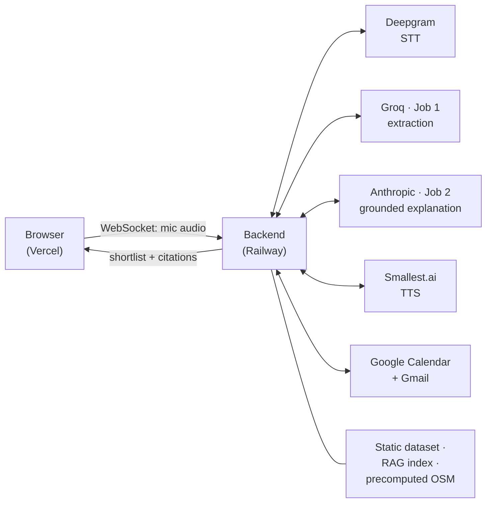

# Voice-based AI Property Scout — Bengaluru

A voice-first rental assistant that collects a tenant's spoken preferences, shortlists real Bengaluru listings, **explains every choice with citations**, and books a site visit on Google Calendar for both tenant and owner.

The problem it addresses isn't finding listings — it's judging whether one fits your life. Is the commute realistic? What's the area actually like? Is the extra room worth the extra rent? Every answer this system gives is traceable to a source, and where it has no source it says so.

> **Status: specification complete, implementation not started.**
> This repository currently contains the problem statement only. Commands, paths and environment variable names below describe the intended build; they are **proposals until the scaffold exists**. Nothing here has been run.

---

## The documents

**[`Problem_Statement_Detailed.md`](./Problem_Statement_Detailed.md) (v3.9) is the single source of truth.** Scope, data schema, latency budget, all 58 error cases, and the sign-off contract live there — and it governs wherever this README, the architecture, or any summary disagrees with it.

**[`Architecture.md`](./Architecture.md)** is how the system is structured to meet it — components, data model, turn lifecycles, error taxonomy, and the decisions taken with their alternatives.

| You are about to… | Read |
|---|---|
| Orient, or set up | this README |
| Decide **what** correct behaviour is | the specification — §6 for failure behaviour, §7.3 for what "done" means |
| Decide **where** code goes, or **how** something is shaped | the architecture — §5 for components, §4 for the data model, §12 for decisions already taken |

The architecture is *derived* from the specification, not independent of it. If the two disagree, the specification wins and the architecture is wrong.

---

## What it does

- **Speak your requirements** — *"2BHK in Koramangala, budget 35k, need parking, close to a metro."* Constraints are always confirmed back before a shortlist is generated.
- **Refine by voice** — *"drop anything above 40k."* Only the affected part changes; everything else keeps its place.
- **Ask why** — every neighborhood claim carries a citation; every distance names the method that produced it.
- **Book a visit** — dual-calendar booking with a confirmation code, cancel and reschedule by voice, PDF emailed on confirmation.

---

## Architecture



**Every provider call originates on the backend.** The browser talks to exactly one origin and holds no keys. The dataset, the closed RAG index and all OpenStreetMap values are resolved at **build time** and served from local storage — no scraping, no retrieval fetching and no OSM lookups happen inside a tenant's turn.

Three structures carry most of the correctness, and are worth knowing before reading any code — all detailed in [`Architecture.md`](./Architecture.md):

- **`Provenanced<T>`** — every fact travels with its source, method, timing and as-of date. A distance without its method label is *unrepresentable*, not merely discouraged
- **The resolver registry** — the grounding boundary is a call graph, so the explanation model can only reach facts through a resolver
- **`TurnOutcome`** — "nothing found" and "couldn't ask" are different variants of a union, so they cannot accidentally render alike

### Two LLM roles, two providers

The pipeline uses two models because the two jobs have opposite requirements:

| Job | Model | Why |
|---|---|---|
| **1 — Extraction & edit routing** | Groq `openai/gpt-oss-120b` | Latency-critical, sits inside the 700 ms acknowledgment budget. Needs schema conformance, not reasoning |
| **2 — Grounded explanation** | Anthropic `claude-sonnet-5` | Decides whether the zero-hallucination bar is met. Off the critical path — capability beats speed |

Both are pinned by **exact model ID, never a `latest` alias** — the CI guarantee is void if the model can change underneath the suite.

---

## Stack

| Layer | Choice |
|---|---|
| Speech-to-text | Deepgram (keyterm boosting, endpointing ≤300 ms) |
| LLM | Groq + Anthropic (see above) |
| Text-to-speech | Smallest.ai, streaming |
| Maps / transit | OpenStreetMap MCP — [jagan-shanmugam/open-streetmap-mcp](https://github.com/jagan-shanmugam/open-streetmap-mcp) |
| Calendar & email | Google Calendar + Gmail, single OAuth |
| Listings source | bengaluru.rent (scraped once) |
| Frontend host | Vercel |
| Backend host | Railway |

---

## Planned structure

```
.
├── Problem_Statement_Detailed.md          # the specification
├── Architecture.md                        # how it is structured
├── frontend/                 # Vercel — UI, view-models, mic client. No keys.
├── backend/                  # Railway — pipeline, both LLM jobs, calendar, PDF
├── data/                     # scraped listings, RAG index, precomputed OSM values
├── scripts/                  # scrape, build index, precompute OSM
└── evals/                    # Suites A, B, C + latency instrumentation
```

---

## Getting started

### Prerequisites

Five credentials, **all set on the backend**. None belong in the frontend or in the repo.

| Variable | Source |
|---|---|
| `DEEPGRAM_API_KEY` | [deepgram.com](https://deepgram.com) |
| `GROQ_API_KEY` | [console.groq.com/keys](https://console.groq.com/keys) |
| `ANTHROPIC_API_KEY` | [console.anthropic.com](https://console.anthropic.com) |
| `SMALLEST_API_KEY` | [app.smallest.ai/dashboard](https://app.smallest.ai/dashboard) |
| `GOOGLE_OAUTH_CREDENTIALS` | Google Cloud Console — Calendar + Gmail scopes |

The frontend takes exactly one backend-related variable, and it is public, not a secret:

| Variable | Value |
|---|---|
| `NEXT_PUBLIC_API_URL` | The Railway backend URL |

### Build order

The build is ordered by **what can invalidate what**, not by what is satisfying to build. Two things can still prove the design wrong, so both are settled first — **in parallel**, each behind a gate. Full detail in §9 of the specification.

**Phase 0 — de-risk (both tracks at once)**

1. **Data** — scrape and curate up to 10 listings per locality; publish the locality list, counts and total; document the availability marker and which schema fields the source actually publishes.
   *Gate:* a missing marker or a thinner-than-assumed schema means **stop and amend the spec** — it changes the filter vocabulary, the cards and the eval coverage.
2. **Infrastructure** — deploy a **walking skeleton** to Railway and Vercel (health check, mic WebSocket, one stub turn touching every provider) and run the **latency spike on it**, comparing candidate regions.
   *Gate:* confirm the latency budget against measurement or renegotiate it in writing. **This has to run on real infrastructure** — measured locally it tells you nothing about the cross-provider, cross-region reality the budget is made of.

**Then, in order**

3. **Knowledge layer** — the listing-scoped RAG index, and the OSM query set run once across every listing with attribution and retrieval date.
4. **Eval harness and the view-model contract** — deliberately before the features they test: Job 2 is validated *against Suite C*, so Suite C exists first, and the card/citation view-model is a contract shared by the suite, the backend and the UI.
5. **Voice pipeline**, then **shortlist and refinement**, then **grounded explanation**.
6. **Booking, PDF and email**, then the **UI**, then hardening and sign-off.

Local development commands will be added with the scaffold.

---

## Deployment

Deployment happens **twice**: a walking skeleton in Phase 0, so the latency budget can be measured on real infrastructure, and the full application later — the same two targets, promoted rather than replaced.

**Backend first, frontend second** — the two hosts deploy independently, so version skew is possible in production even when CI is green. The backend exposes a contract version and the frontend pins the one it expects.

**Railway (backend)**
- App sleeping **off** — a sleeping instance wakes on the tenant's first word and misses every latency target
- One long-lived process, holding the Deepgram WebSocket and keep-alive pools
- Healthcheck endpoint configured
- Region chosen by measurement, not intuition — the backend makes many round trips to providers but holds only one stream to the browser

**Vercel (frontend)**
- Static/SSR only — **no API routes.** Serverless functions can't hold the persistent connections the latency budget depends on
- Preview deployments create new origins; include them in the CORS allowlist deliberately or restrict the backend to production

CORS is an **explicit allowlist, never `*`**. The mic WebSocket goes browser → backend directly, never proxied.

---

## Testing

Three suites, 20 cases each, **60 total at 100% pass, run 3× in CI**.

| Suite | Checks |
|---|---|
| **A — Feasibility** | Shortlist respects budget, bedrooms and must-haves; ≥1 case per schema field; `null` handling |
| **B — Edit correctness** | Untouched listings and their order are **byte-identical** before and after a voice edit |
| **C — Grounding** | Citations resolve to the correct listing-scoped source; gaps declared; injection and cross-locality contamination probes |

Latency is instrumented per component and scored at p99, **separately per turn type**. See §7.3 of the full statement for the complete sign-off contract.

---

## Non-negotiables

If you contribute one thing to this codebase, know these:

1. **Never fabricate to cover a gap.** *"I don't have that"* is always a correct answer. A fluent answer with no source behind it is the worst failure this system can produce.
2. **"Couldn't ask" and "nothing found" must never look alike.** An empty shortlist because nothing matched is a *result*; an empty shortlist because a service failed is an *error*. Rendering them identically is the likeliest way this system misleads someone.
3. **Every distance names its method.** *"About 15 minutes to the metro"* is a red-line failure. A straight-line figure heard as a travel time understates a Bengaluru commute enough to change someone's decision — so the words *by route* or *straight line* are mandatory, in speech and on the card.
4. **`null` is a real value, and it never satisfies a must-have.** Unstated fields read *"not stated"* — never blank, never zero, never inferred. Unknowns surface as their own group rather than being silently dropped or silently counted.
5. **Scraped text and retrieved chunks are untrusted data**, delimited in prompts and never executed as instructions.
6. **Slot arithmetic is always `Asia/Kolkata`**, never server-local time. The backend is deliberately hosted outside India.

---

## Out of scope (MVP)

Login and accounts · post-visit feedback · cross-session preference history · mobile app · languages beyond English · production-grade privacy compliance.

Owner contact is the labelled placeholder `999999999` throughout — deliberately not a valid Indian mobile number, so nothing in a demo can dial a real person.
